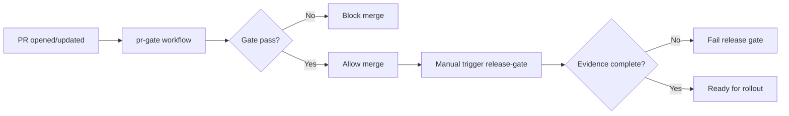

# AI Delivery Blueprint v1

## 目标

把当前“主 Agent + 子 Agent + Issue 波次”流程固化成可自动执行的仓库规则，达到：

1. 自动门禁（测试、证据、变更范围）
2. 自动发布前核验（Gate 4/5/6）
3. 自动化协作手册（Agent 可直接按模板执行）

## 设计原则

1. 先稳定后自动：先把检查做成 workflow，再扩大自动合并范围。
2. 默认保守：高风险发布仍保留人工批准。
3. 证据优先：任何“通过”必须有可追溯证据文件。

## 仓库结构（v1）

```text
.github/workflows/
  pr-gate.yml
  release-gate.yml
  issue-evidence-check.yml

policies/
  merge-gate.yml
  release-gate.yml

agents/playbooks/
  issue-executor.md
```

## 自动化流程（v1）



## v1 门禁定义

### PR Gate

- 禁止提交构建产物（如 `backend/target/**`）
- 若后端有变更，必须执行 `mvn test`
- 仅通过后允许进入合并阶段

### Release Gate（手动触发）

- 检查 Gate 4/5/6 证据文件存在：
  - `backend/evidence/gate4-regression/summary.md`
  - `backend/evidence/gate5-event-mapping/summary.md`
  - `backend/evidence/gate6-trace-audit/summary.md`
- 检查策略文件存在：
  - `policies/merge-gate.yml`
  - `policies/release-gate.yml`

## 启用步骤

1. 合并本次新增的 workflow/policy/playbook 文件。
2. 在 GitHub `Branch protection` 中把 `PR Gate` 设为 required check。
3. 保持 `release-gate.yml` 由主控手动触发（生产前）。
4. 每个 issue 完成后在对应 issue 评论区贴证据链接。

## 后续演进（v2+）

1. 自动评论 issue 证据链接（由 CI 代发）。
2. 自动生成门禁汇总看板（Issue + PR + Evidence）。
3. 对低风险变更启用 auto-merge，对高风险变更保留人工批准。
