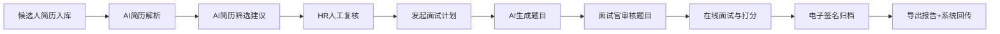
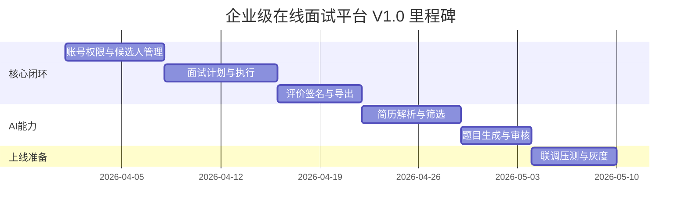

# 企业级在线面试平台 V1.0 PRD（2026 年 03 月）

## 1. 文档信息

- 产品名称：企业级在线面试平台
- 版本：V1.0
- 文档类型：PRD（产品需求文档）
- 更新日期：2026-03
- 目标读者：产品、研发、测试、实施、运营、合规

---

## 2. 背景与问题定义

企业招聘流程中，常见问题包括：面试流程不统一、评价口径不一致、简历初筛效率低、面试题质量不稳定、结果追溯困难。  
本产品面向中大型企业，建设私有化可落地的在线面试平台，形成“候选人进入 -> 面试执行 -> 结果归档 -> 对接企业系统”的闭环。

### 2.1 当前痛点

1. HR 初筛简历耗时高，人工口径不一致，容易漏筛优质候选人。  
2. 面试官出题质量波动大，缺少结构化题库和统一评分标准。  
3. 面试过程与结果分散在多系统，审计和复盘成本高。  
4. 合规风险较高，签名和留痕能力弱。

### 2.2 目标用户

- HR 管理员：负责候选人筛选、面试排期、结果复核。
- 面试官：负责面试执行、打分评价、题目选择与追问。
- 候选人：参加在线面试，接收邀约和结果通知（可配置）。
- 系统管理员/对接管理员：负责权限、对接、审计与运维。

---

## 3. 产品目标与量化指标（KPI）

### 3.1 业务目标

1. 提升招聘效率：缩短从简历进入到面试安排的周期。  
2. 提升面试质量：统一评价标准，减少主观波动。  
3. 提升合规性：确保关键节点可追溯、可审计。  
4. 提升系统可用性：保障高并发面试场景稳定运行。

### 3.2 KPI（上线 3 个月目标）

|指标|当前基线|目标值|
|---|---|---|
|简历初筛平均耗时|2 天|<= 4 小时|
|简历解析成功率|-|>= 95%（可解析简历）|
|AI筛选后人工改判率|-|<= 20%（持续优化）|
|题目审核一次通过率|-|>= 80%|
|面试流程准时开场率|75%|>= 92%|
|面试评价提交完整率|70%|>= 95%|
|系统可用性|98.5%|>= 99.9%|

---

## 4. 范围定义

### 4.1 In Scope（V1.0 范围内）

1. 候选人管理、面试计划、在线面试、打分评价、电子签名、导出、开放对接。  
2. AI 能力（辅助）：简历解析、简历筛选、题目生成。  
3. AI 结果人工复核闭环（必须人工确认，不自动最终决策）。

### 4.2 Out of Scope（V1.0 不做）

1. 全自动录用决策。  
2. 跨语言实时同传。  
3. AI 自动发 Offer 与薪资建议。  
4. 全行业通用知识图谱与复杂人才画像引擎。

---

## 5. 关键用户旅程

---

## 6. 功能需求

### 6.1 候选人与面试流程管理

- 候选人信息录入/同步、状态管理、历史记录查询。  
- 面试计划创建与更新：岗位、轮次、面试官、时间、模板关联。  
- 邀约通知：邮件/短信/企业IM；支持提醒与改期。  
- 面试执行：音视频、共享、白板、断线重连、录制。

### 6.2 评价与签名

- 面试官结构化评分、评语、建议（通过/待定/淘汰）。  
- 多面试官评分汇总与 HR 复核。  
- 电子签名归档、防篡改、可验签。  
- Word/Excel 导出与模板化。

### 6.3 AI 能力（辅助决策）

#### 6.3.1 AI 简历解析

- 输入：PDF/Word 简历。  
- 输出：结构化字段（基础信息、教育、经历、项目、技能标签）。  
- 要求：失败可重试、可人工补录、全程记录模型版本。

#### 6.3.2 AI 简历筛选

- 输入：结构化简历 + 岗位 JD。  
- 输出：匹配分、推荐等级、理由、风险标签。  
- 规则：强制人工复核；不可自动淘汰候选人。

#### 6.3.3 AI 题目生成

- 输入：岗位、难度、技术栈、题目数。  
- 输出：题干、参考答案、评分点、追问建议。  
- 规则：先审核后发布，过滤不合规题目。

---

## 7. 非功能需求

### 7.1 性能

- 核心接口 P95 <= 500ms（不含 AI 异步任务）。  
- 单实例支持 1000+ 并发面试间（按集群扩展）。  
- 导出 1000 条数据耗时 <= 10s。

### 7.2 稳定性

- 系统可用性 >= 99.9%。  
- AI 服务异常时可降级为人工模式。  
- 关键任务（解析/筛选/出题）支持重试与告警。

### 7.3 安全与合规

- 敏感信息加密存储、传输 HTTPS。  
- AI 入模前脱敏，结果可追溯（模型版本/输入快照哈希）。  
- 全流程操作审计留痕，不可篡改。

---

## 8. 优先级与版本规划

|阶段|优先级|范围|验收结果|
|---|---|---|---|
|Phase 1|P0|账号权限、候选人管理、面试计划、评价基础|主流程可跑通|
|Phase 2|P0|在线面试间、评分汇总、导出、签名|结果可闭环|
|Phase 3|P1|开放 API、Webhook、SSO|可接企业系统|
|Phase 4|P1|AI 简历解析、AI 筛选（人工复核）|初筛效率提升|
|Phase 5|P2|AI 出题+题库审核、运营优化|题目质量可控|

---

## 9. 核心流程验收标准（DoD）

1. 任一候选人从入库到面试完成，全链路状态可追踪。  
2. 任一面试评价提交后，必须有签名和时间戳记录。  
3. AI 筛选结论无人工复核时，系统不允许直接进入“淘汰”终态。  
4. AI 出题未审核，不得进入正式题库。  
5. 导出报告与系统回传数据字段一致，可审计回放。

---

## 10. 风险与应对

|风险|影响|应对策略|
|---|---|---|
|AI 幻觉或误判|错误筛选候选人|强制人工复核、低置信度拦截|
|简历质量参差（扫描件）|解析失败率上升|OCR兜底、失败重试、人工补录|
|AI 服务不可用|流程中断|异步重试、降级到人工流程|
|合规风险|审计和法律风险|脱敏入模、全量留痕、权限隔离|
|题目质量不稳定|面试质量下降|题目审核机制+反馈闭环优化|

---

## 11. 数据指标与复盘机制

### 11.1 日常看板指标

- 简历解析成功率、失败原因分布  
- AI筛选覆盖率、改判率、通过率分布  
- 题目生成使用率、审核通过率、面试官采纳率  
- 面试准时开场率、评价完整率、导出成功率

### 11.2 复盘节奏

- 周复盘：异常案例、误判案例、题目质量问题。  
- 月复盘：KPI 达成情况、模型策略调整、权重配置优化。

---

## 12. 对外依赖

1. 企业 SSO 与组织架构系统  
2. 消息渠道（短信/邮件/IM）  
3. 音视频基础能力  
4. 电子签名服务（可选第三方）  
5. 大模型/向量检索/OCR 服务

---

## 13. 10 条验收 Case（输入与预期结果）

|Case|输入|预期结果|
|---|---|---|
|1|上传标准 PDF 简历|解析成功，结构化字段完整率 >= 90%|
|2|上传模糊扫描件|解析失败并返回可读失败原因|
|3|触发 AI 筛选（岗位JD完整）|返回匹配分+推荐等级+理由|
|4|触发 AI 筛选（关键信息缺失）|返回风险标签“关键信息缺失”|
|5|AI 给出“不推荐”|必须进入 HR 复核队列，不能自动淘汰|
|6|生成 5 道后端中级题|每题包含答案/评分点/追问|
|7|生成题目含违规内容|审核驳回，不入题库|
|8|面试完成后提交评价|触发签名流程，归档可追溯|
|9|批量导出 1000 条|10 秒内完成并可下载|
|10|AI 服务超时|任务失败并可一键重试，主流程不中断|

---

## 14. 里程碑建议（业务视角）

---

## 15. 附录

- 说明：本 PRD 与《企业级在线面试平台 V1.0 详细设计》配套使用。  
- 原则：PRD 定义“做什么和为什么”，详细设计定义“怎么做”。

