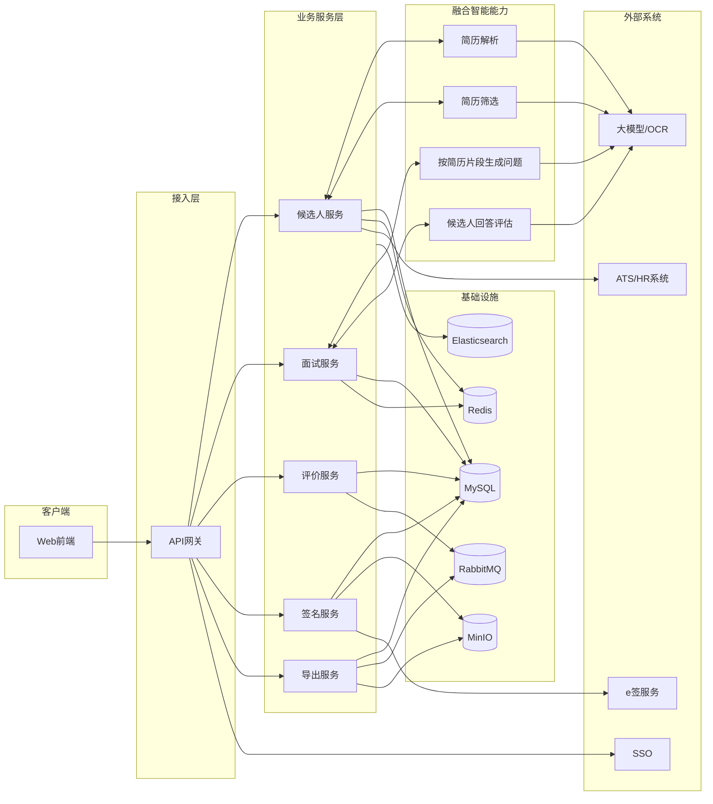
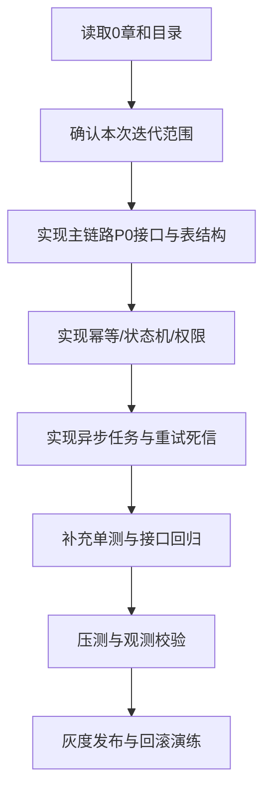
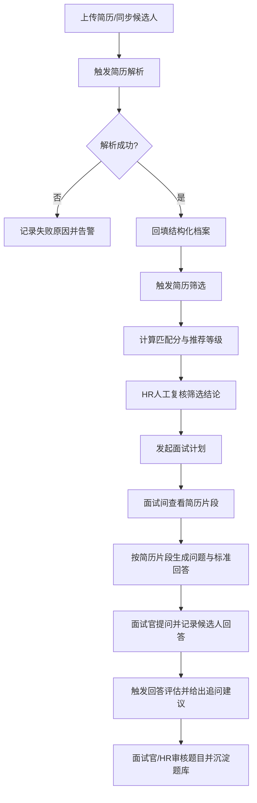
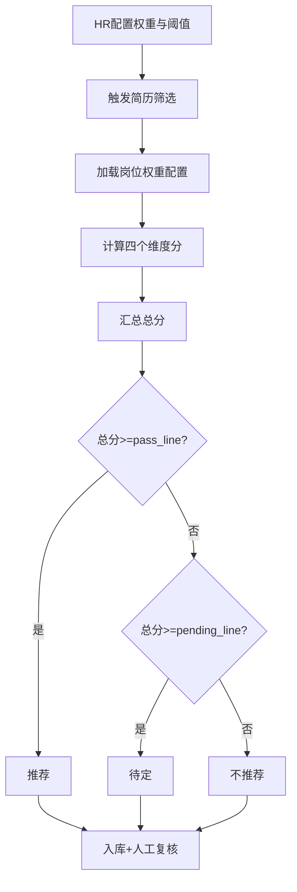
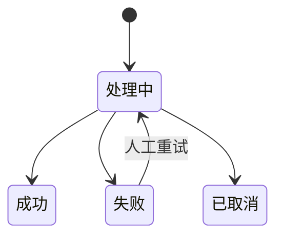
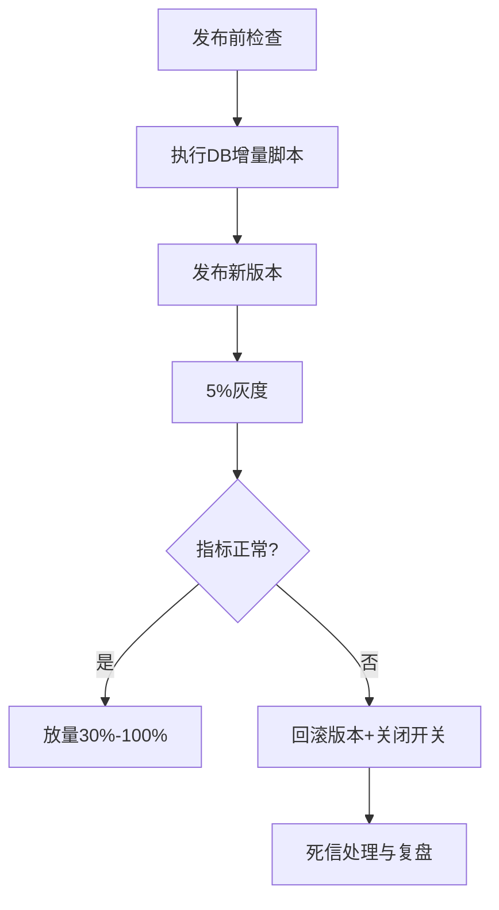
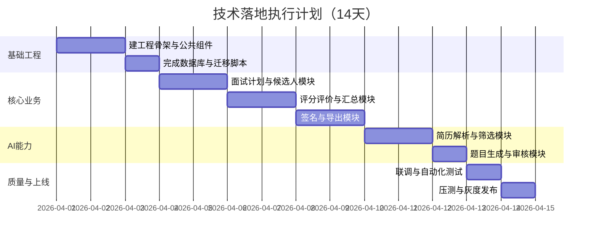

@# 企业级在线面试平台 V10 详细设计（2026 年 03 月）

# 企业级在线面试管理平台 详细设计文档

**文档版本**：V10
**更新日期**：2026年03月
**对标产品**：Moka面试系统
**核心目标**：可直接交付AI Agent进行全流程代码实现，覆盖在线面试、结构化打分、多维度评价、合规电子签名、企业系统打通、多格式结果导出全链路能力
**技术栈锁定**：全栈主流技术选型，无小众依赖，Agent可直接复用开源生态实现

---

## 目录

1. 开发入口（给AI）
2. 项目概述与需求规格
3. 系统整体架构设计
4. 核心角色与权限矩阵
5. 数据库详细设计（含建表SQL）
6. 核心业务模块详细设计（含接口定义）
7. 企业自有系统打通方案（开放平台）
8. 面试结果导出模块设计（Word/Excel）
9. 电子签名合规实现方案
10. 非功能性需求与安全设计
11. 部署与运维方案
12. AI Agent开发执行指南（优先级里程碑）
13. 统一代码规范与错误码体系
14. 融合智能能力设计（嵌入候选人筛选与面试流程）
15. 工程化落地补充规范（接口/状态机/一致性/观测/压测/发布）

---

## 0 开发入口（给AI）

本章节是 AI 编码执行入口。要求 AI 在开发前先读取本章节，再按后续章节实现，禁止跳过。

### 01 系统级组件关系图（先读）




### 02 AI执行顺序图（必须按顺序）




### 03 顶层设计约束（强制）

1. 分层依赖必须单向：`api -> service -> infra`，禁止反向依赖。
2. 所有写接口必须支持幂等键，重复请求不得产生副作用。
3. 状态流转必须遵循状态机，禁止跨状态非法更新。
4. AI只输出建议，不得自动写入最终录用结论。
5. 外部调用（LLM/OCR/e签）统一走适配层，不可在业务层直连。
6. 审计留痕必须覆盖关键动作：筛选复核、问题生成、回答评估、签名、导出。
7. 任何失败必须可追踪：`traceId + bizCode + errorCode`。
8. 发布采用灰度 + 功能开关，禁止一次性全量开关上线。

### 04 软件工程规范与门禁

#### 041 代码规范

- 后端：Controller 只做参数与鉴权，业务逻辑全部在 Service。  
- Service 函数建议不超过 80 行，圈复杂度建议 <= 10。  
- 所有状态字段必须使用枚举，不允许魔法数字散落代码。  
- 所有跨服务消息体必须有 `eventCode`、`traceId`、`bizCode`。

#### 042 测试门禁

- 单测覆盖率：核心模块 >= 80%。  
- 状态机分支覆盖：>= 95%。  
- 幂等/并发/重试相关场景必须有自动化用例。  
- P0/P1 接口回归通过率必须 100% 才可发版。

#### 043 发布门禁

- 压测阈值达到 `14.8.3`。  
- 监控与告警规则上线并验证。  
- 5% 灰度 30 分钟无 P1 告警。  
- 回滚演练通过（应用回滚 + 开关关闭 + 死信处置）。

### 05 AI开工输入清单（一次给全）

1. 本文档全文（含第 14 章工程规范）。
2. 本次迭代范围（功能列表 + 非目标清单）。
3. 环境配置（数据库、缓存、MQ、对象存储、模型服务地址）。
4. 错误码与枚举定义（第 12 章 + 14.11）。
5. 接口契约与JSON示例（第 5 章 + 14.10）。
6. 状态机与权限规则（14.2 + 14.7）。
7. 验收标准（14.16.3 + 14.18）。

### 06 AI执行输出要求（每次迭代）

1. 提交代码变更清单（文件路径 + 改动目的）。
2. 提交数据库变更与回滚脚本。
3. 提交接口自测结果（请求样例 + 响应样例）。
4. 提交失败重试与死信验证记录。
5. 提交压测摘要与告警截图（或指标导出）。
6. 提交上线与回滚操作记录。

---

## 1 项目概述与需求规格

### 11 项目背景

为企业打造私有化部署、可深度定制、支持与内部HR/ATS/OA系统无缝打通的在线面试平台，替代Moka等第三方SaaS，实现面试全流程数字化闭环，核心解决面试过程标准化、评价可追溯、结果可同步、合规可审计的核心诉求。

### 12 核心业务目标

1. 完整覆盖面试全流程：简历入库→简历解析与筛选→排期→面试间→身份核验→实时互动→结构化打分→评价归档→电子签名→结果同步→报告导出
2. 支持多角色协同：HR、面试官、候选人、管理员、系统对接人
3. 100%兼容企业内部系统对接，提供标准化开放接口与数据同步能力
4. 支持标准化导出：单条/批量导出Word（面试报告）、Excel（成绩汇总表、简历筛选汇总表）
5. 满足企业级合规要求：全程留痕、权限隔离、数据加密、审计日志

### 13 功能性需求清单（颗粒度到可开发级别）


| 模块      | 子功能       | 详细需求描述                                                           |
| ------- | --------- | ---------------------------------------------------------------- |
| 用户与权限管理 | 角色管理      | 支持RBAC权限模型，可自定义角色、分配菜单/数据权限                                      |
|         | 用户管理      | 企业内部用户（HR/面试官/管理员）批量导入、账号管理、SSO单点登录                              |
|         | 候选人管理     | 候选人信息录入/同步、简历上传、简历解析、筛选结论复核、面试邀约发送、面试记录全生命周期管理                   |
| 面试模板管理  | 打分模板配置    | 支持按岗位/面试轮次自定义打分项、权重、评分标准、满分值；支持模板复用                              |
|         | 评价模板配置    | 自定义评价维度、必填项/选填项、评语模板库                                            |
|         | 面试流程配置    | 自定义面试轮次、面试官人数、评分规则（平均分/加权分/一票否决）                                 |
| 面试全流程管理 | 面试计划创建    | HR可创建面试，关联候选人、岗位、轮次、面试官、打分模板、时间、面试间；支持按筛选结论批量发起面试                |
|         | 面试邀约      | 系统自动发送短信/邮件/企业微信/钉钉邀约，含面试链接、入会须知、日历提醒                            |
|         | 在线面试间     | 支持音视频通话、屏幕共享、白板协作、面试全程录制、断线重连、候场室；面试官可查看候选人简历并按简历片段触发AI出题与标准回答建议 |
|         | 身份核验      | 候选人人脸核验、身份证核验、实人认证，防替考作弊                                         |
| 打分与评价模块 | 实时打分      | 面试官面试过程中可实时填写打分项、系统自动计算总分，支持暂存                                   |
|         | 多维度评价     | 支持结构化评语、关键词标签、优缺点记录、面试建议（通过/待定/淘汰）                               |
|         | 多人评分汇总    | 多面试官面试结束后，系统按规则自动汇总评分，生成综合评价报告                                   |
|         | 评分校准      | HR可查看所有面试官评分详情，支持校准、备注、复核                                        |
|         | 回答评估辅助    | 支持对候选人某轮回答触发AI评估（覆盖度、准确性、表达清晰度），仅作为参考意见，不替代面试官最终评价               |
| 电子签名模块  | 签名发起      | 面试评价提交后，自动发起面试官电子签名流程，支持批量签名                                     |
|         | 签名能力      | 支持手写签名、时间戳、签名证书、防篡改，签名后评价报告锁定不可修改                                |
|         | 签名归档      | 签名文件与面试报告绑定，永久归档，支持合规审计                                          |
| 系统对接模块  | 开放API     | 提供RESTful标准化接口，支持与企业HR/ATS/OA/组织架构系统打通                           |
|         | 数据同步      | 支持候选人信息、面试计划、面试结果双向同步，支持增量同步                                     |
|         | Webhook订阅 | 企业系统可订阅面试事件（邀约发送、面试完成、评价提交、签名完成）                                 |
|         | SSO单点登录   | 支持OAuth20/CAS/SAML协议，与企业内部账号体系打通                                 |
| 导出模块    | Excel导出   | 支持单条/批量导出面试成绩汇总表，含候选人信息、各面试官打分、总分、面试结果                           |
|         | 筛选Excel导出 | 支持导出简历筛选汇总表，含解析关键信息、筛选分、推荐等级、复核结果、复核人                            |
|         | Word导出    | 导出标准化面试评价报告，含候选人信息、面试详情、打分明细、评语、电子签名、时间戳                         |
|         | 自定义模板     | 支持企业上传自定义Word/Excel模板，配置占位符映射规则                                  |
| 审计与日志   | 操作日志      | 全平台用户操作全记录，含操作人、时间、IP、操作内容、操作结果                                  |
|         | 面试日志      | 面试间进出、音视频录制、切屏、打分提交、签名全流程留痕                                      |
|         | 导出日志      | 所有导出操作全记录，含导出人、导出内容、导出时间、文件哈希                                    |


### 14 非功能性需求

1. **性能需求**：单实例支持1000并发在线面试间，核心接口响应时间≤500ms，页面加载时间≤2s，导出1000条数据耗时≤10s
2. **兼容性需求**：PC端支持Chrome、Edge、Safari最新3个版本；移动端支持微信/企业微信/钉钉内置浏览器；音视频适配Windows/macOS/iOS/Android
3. **可用性需求**：系统可用性≥999%，核心服务支持集群部署，故障自动切换，数据备份恢复时间≤30分钟
4. **合规需求**：满足《个人信息保护法》，候选人信息加密存储，面试录制文件加密归档，操作日志留存≥180天
5. **安全性需求**：接口全链路鉴权，防SQL注入、XSS攻击、CSRF攻击，面试间加密，权限最小化控制

---

## 2 系统整体架构设计

采用**前后端分离微服务分层架构**，可支持单体快速落地，也可平滑扩展为微服务集群，AI Agent可先基于单体架构实现，后续按需拆分。

### 21 整体架构分层

```Plaintext
┌─────────────────────────────────────────────────────────────┐
│  接入层  │  Nginx反向代理、负载均衡、HTTPS终结、静态资源缓存  │
├─────────────────────────────────────────────────────────────┤
│  应用层  │  前端Web应用 + 后端业务服务 + 开放API网关 + AI服务网关 │
├─────────────────────────────────────────────────────────────┤
│  中间件层 │  Redis缓存、RabbitMQ消息队列、音视频SFU、存储服务、向量检索 │
├─────────────────────────────────────────────────────────────┤
│  数据层  │  MySQL业务数据库、MinIO对象存储、Elasticsearch日志 │
└─────────────────────────────────────────────────────────────┘
```

### 22 技术栈锁定（Agent直接使用，无需选型）


| 分层    | 技术选型                                                           | 选型说明                                    |
| ----- | -------------------------------------------------------------- | --------------------------------------- |
| 前端    | Vue3 TypeScript Element Plus Pinia Vue Router                  | 主流企业级前端栈，组件丰富，开发效率高，适配后台管理系统            |
| 前端音视频 | WebRTC 腾讯云音视频SDK（备选）                                           | 自研WebRTC满足私有化，备选SDK降低开发难度，直接对接成熟能力      |
| 后端    | JDK17 SpringBoot 32x SpringSecurity MyBatisPlus                | 稳定、生态完善，企业级开发首选，支持高并发，文档丰富              |
| 数据库   | MySQL 80                                                       | 主流关系型数据库，支持事务，适配企业级业务                   |
| 缓存    | Redis 7x                                                       | 用于会话管理、接口限流、面试间状态缓存、临时数据存储              |
| 消息队列  | RabbitMQ                                                       | 用于异步通知、邮件/短信发送、录制文件处理、数据同步              |
| 对象存储  | MinIO                                                          | 私有化部署，存储面试录制文件、签名图片、导出报告、附件             |
| 电子签名  | 自研简易手写签名 e签宝/法大大SDK（合规备选）                                      | 自研满足内部使用，对接第三方满足司法合规需求                  |
| 导出能力  | EasyExcel（Excel导出） POITL（Word导出）                               | 国内主流开源导出工具，性能优异，支持模板自定义                 |
| AI能力  | Spring AI OpenAI兼容大模型API OCR（PaddleOCR/Tika） pgvector（或Milvus） | 用于简历解析、匹配打分、题目生成与相似题检索，全部采用主流生态，便于私有化替换 |
| 部署    | Docker Docker Compose（基础） K8s（集群扩展）                            | 一键部署，适配私有化环境，Agent可先基于Docker Compose实现  |


### 23 核心业务流程泳道图（Agent可直接按此开发业务逻辑）

```Plaintext
【HR】→ 1.收到简历并上传平台 → 2.触发简历解析与筛选 → 3.人工复核筛选结论（通过/待定/淘汰）
【系统】→ 4.生成筛选标准Excel汇总（可单条/批量导出） → 5.筛选通过候选人进入面试排期池
【HR】→ 6.创建面试计划/选择打分模板 → 7.关联面试官/候选人 → 8.设置面试时间/规则
【系统】→ 9.生成面试间/面试链接 → 10.发送邀约给面试官&候选人 → 11.日历提醒
【候选人】→ 12.点击链接进入候场室 → 13.完成身份核验 → 14.进入面试间
【面试官】→ 15.进入面试间并查看候选人简历 → 16.按简历片段触发AI生成问题/标准答案 → 17.发起音视频面试
【面试官】→ 18.记录候选人回答并触发AI回答评估（参考） → 19.实时填写打分/评语 → 20.面试结束提交评价 → 21.完成电子签名
【系统】→ 22.汇总多面试官评分 → 23.生成最终面试报告 → 24.通过Webhook/API同步到企业系统
【HR/面试官】→ 25.单条/批量导出Word/Excel报告（含筛选与面试结果）
【系统】→ 26.归档全流程数据/录制文件/AI建议记录 → 27.记录操作审计日志
```

---

## 3 核心角色与权限矩阵

采用标准RBAC模型，预定义5个核心角色，支持自定义角色，Agent可直接基于此实现权限控制。


| 角色      | 核心权限                                        | 数据范围               |
| ------- | ------------------------------------------- | ------------------ |
| 超级管理员   | 系统配置、角色管理、用户管理、模板管理、所有数据查看、审计日志、开放平台配置      | 全企业所有数据            |
| HR管理员   | 面试计划创建/管理、候选人管理、面试官分配、模板配置、面试结果复核、报告导出、数据查看 | 负责的招聘项目/全公司数据（可配置） |
| 面试官     | 查看自己负责的面试、进入面试间、打分评价、电子签名、查看自己的面试历史         | 仅自己作为面试官的面试数据      |
| 候选人     | 查看自己的面试邀约、进入对应面试间、查看面试结果（可配置）               | 仅自己的个人信息与面试数据      |
| 系统对接管理员 | 开放平台API密钥管理、Webhook配置、对接日志查看、接口权限配置         | 仅系统对接相关配置与日志       |


---

## 4 数据库详细设计

### 41 数据库规范

- 数据库名：`interview\_platform`AI简历筛选结果表
- 字符集：`utf8mb4`
- 排序规则：`utf8mb4\_unicode\_ci`
- 所有表必须包含：`id`（主键，自增）、`create\_time`、`update\_time`、`is\_deleted`（逻辑删除，0=未删除，1=已删除）
- 索引规范：主键索引、唯一索引、普通索引明确区分，关联字段必须加索引

### 42 核心表结构（含完整建表SQL，Agent可直接执行）

```SQL
-- 1. 用户表
CREATE TABLE `sys_user` (
  `id` bigint NOT NULL AUTO_INCREMENT COMMENT '主键ID',
  `username` varchar(64) NOT NULL COMMENT '登录账号',
  `password` varchar(128) NOT NULL COMMENT '加密密码',
  `real_name` varchar(32) NOT NULL COMMENT '真实姓名',
  `phone` varchar(16) DEFAULT NULL COMMENT '手机号',
  `email` varchar(64) DEFAULT NULL COMMENT '邮箱',
  `dept_id` bigint DEFAULT NULL COMMENT '部门ID',
  `role_id` bigint NOT NULL COMMENT '角色ID',
  `status` tinyint NOT NULL DEFAULT '1' COMMENT '状态 0-禁用 1-启用',
  `last_login_time` datetime DEFAULT NULL COMMENT '最后登录时间',
  `last_login_ip` varchar(32) DEFAULT NULL COMMENT '最后登录IP',
  `create_time` datetime NOT NULL DEFAULT CURRENT_TIMESTAMP COMMENT '创建时间',
  `update_time` datetime NOT NULL DEFAULT CURRENT_TIMESTAMP ON UPDATE CURRENT_TIMESTAMP COMMENT '更新时间',
  `is_deleted` tinyint NOT NULL DEFAULT '0' COMMENT '逻辑删除',
  PRIMARY KEY (`id`),
  UNIQUE KEY `uk_username` (`username`),
  KEY `idx_role_id` (`role_id`),
  KEY `idx_dept_id` (`dept_id`)
) ENGINE=InnoDB DEFAULT CHARSET=utf8mb4 COLLATE=utf8mb4_unicode_ci COMMENT='系统用户表';

-- 2. 角色表
CREATE TABLE `sys_role` (
  `id` bigint NOT NULL AUTO_INCREMENT COMMENT '主键ID',
  `role_name` varchar(32) NOT NULL COMMENT '角色名称',
  `role_code` varchar(32) NOT NULL COMMENT '角色编码',
  `description` varchar(256) DEFAULT NULL COMMENT '角色描述',
  `create_time` datetime NOT NULL DEFAULT CURRENT_TIMESTAMP COMMENT '创建时间',
  `update_time` datetime NOT NULL DEFAULT CURRENT_TIMESTAMP ON UPDATE CURRENT_TIMESTAMP COMMENT '更新时间',
  `is_deleted` tinyint NOT NULL DEFAULT '0' COMMENT '逻辑删除',
  PRIMARY KEY (`id`),
  UNIQUE KEY `uk_role_code` (`role_code`)
) ENGINE=InnoDB DEFAULT CHARSET=utf8mb4 COLLATE=utf8mb4_unicode_ci COMMENT='系统角色表';

-- 3. 权限菜单表
CREATE TABLE `sys_menu` (
  `id` bigint NOT NULL AUTO_INCREMENT COMMENT '主键ID',
  `parent_id` bigint NOT NULL DEFAULT '0' COMMENT '父菜单ID',
  `menu_name` varchar(32) NOT NULL COMMENT '菜单名称',
  `menu_code` varchar(64) NOT NULL COMMENT '权限编码',
  `menu_type` tinyint NOT NULL COMMENT '菜单类型 1-目录 2-菜单 3-按钮',
  `path` varchar(128) DEFAULT NULL COMMENT '路由路径',
  `icon` varchar(64) DEFAULT NULL COMMENT '菜单图标',
  `sort` int NOT NULL DEFAULT '0' COMMENT '排序',
  `status` tinyint NOT NULL DEFAULT '1' COMMENT '状态 0-禁用 1-启用',
  `create_time` datetime NOT NULL DEFAULT CURRENT_TIMESTAMP COMMENT '创建时间',
  `update_time` datetime NOT NULL DEFAULT CURRENT_TIMESTAMP ON UPDATE CURRENT_TIMESTAMP COMMENT '更新时间',
  `is_deleted` tinyint NOT NULL DEFAULT '0' COMMENT '逻辑删除',
  PRIMARY KEY (`id`),
  UNIQUE KEY `uk_menu_code` (`menu_code`),
  KEY `idx_parent_id` (`parent_id`)
) ENGINE=InnoDB DEFAULT CHARSET=utf8mb4 COLLATE=utf8mb4_unicode_ci COMMENT='系统权限菜单表';

-- 4. 角色权限关联表
CREATE TABLE `sys_role_menu` (
  `id` bigint NOT NULL AUTO_INCREMENT COMMENT '主键ID',
  `role_id` bigint NOT NULL COMMENT '角色ID',
  `menu_id` bigint NOT NULL COMMENT '菜单ID',
  `create_time` datetime NOT NULL DEFAULT CURRENT_TIMESTAMP COMMENT '创建时间',
  `is_deleted` tinyint NOT NULL DEFAULT '0' COMMENT '逻辑删除',
  PRIMARY KEY (`id`),
  UNIQUE KEY `uk_role_menu` (`role_id`,`menu_id`),
  KEY `idx_menu_id` (`menu_id`)
) ENGINE=InnoDB DEFAULT CHARSET=utf8mb4 COLLATE=utf8mb4_unicode_ci COMMENT='角色权限关联表';

-- 5. 候选人信息表
CREATE TABLE `interview_candidate` (
  `id` bigint NOT NULL AUTO_INCREMENT COMMENT '主键ID',
  `candidate_code` varchar(32) NOT NULL COMMENT '候选人唯一编码',
  `name` varchar(32) NOT NULL COMMENT '姓名',
  `phone` varchar(16) NOT NULL COMMENT '手机号',
  `email` varchar(64) DEFAULT NULL COMMENT '邮箱',
  `id_card` varchar(32) DEFAULT NULL COMMENT '身份证号（加密存储）',
  `gender` tinyint DEFAULT NULL COMMENT '性别 1-男 2-女',
  `age` int DEFAULT NULL COMMENT '年龄',
  `apply_position` varchar(64) NOT NULL COMMENT '应聘岗位',
  `work_years` varchar(16) DEFAULT NULL COMMENT '工作年限',
  `highest_education` varchar(16) DEFAULT NULL COMMENT '最高学历',
  `resume_url` varchar(256) DEFAULT NULL COMMENT '简历文件地址',
  `source` varchar(32) DEFAULT NULL COMMENT '简历来源',
  `status` tinyint NOT NULL DEFAULT '1' COMMENT '候选人状态 1-待面试 2-面试中 3-已通过 4-已淘汰 5-已待定',
  `create_user` bigint NOT NULL COMMENT '创建人ID',
  `create_time` datetime NOT NULL DEFAULT CURRENT_TIMESTAMP COMMENT '创建时间',
  `update_time` datetime NOT NULL DEFAULT CURRENT_TIMESTAMP ON UPDATE CURRENT_TIMESTAMP COMMENT '更新时间',
  `is_deleted` tinyint NOT NULL DEFAULT '0' COMMENT '逻辑删除',
  PRIMARY KEY (`id`),
  UNIQUE KEY `uk_candidate_code` (`candidate_code`),
  KEY `idx_phone` (`phone`),
  KEY `idx_apply_position` (`apply_position`),
  KEY `idx_status` (`status`)
) ENGINE=InnoDB DEFAULT CHARSET=utf8mb4 COLLATE=utf8mb4_unicode_ci COMMENT='候选人信息表';

-- 6. 面试打分模板表
CREATE TABLE `interview_score_template` (
  `id` bigint NOT NULL AUTO_INCREMENT COMMENT '主键ID',
  `template_name` varchar(64) NOT NULL COMMENT '模板名称',
  `template_code` varchar(32) NOT NULL COMMENT '模板编码',
  `apply_position_type` varchar(32) DEFAULT NULL COMMENT '适用岗位类型',
  `interview_round` varchar(16) DEFAULT NULL COMMENT '适用面试轮次',
  `full_score` int NOT NULL DEFAULT '100' COMMENT '满分值',
  `pass_score` int NOT NULL DEFAULT '60' COMMENT '及格线',
  `score_rule` tinyint NOT NULL DEFAULT '1' COMMENT '汇总规则 1-平均分 2-加权分 3-去掉最高最低取平均',
  `description` varchar(256) DEFAULT NULL COMMENT '模板描述',
  `status` tinyint NOT NULL DEFAULT '1' COMMENT '状态 0-禁用 1-启用',
  `create_user` bigint NOT NULL COMMENT '创建人ID',
  `create_time` datetime NOT NULL DEFAULT CURRENT_TIMESTAMP COMMENT '创建时间',
  `update_time` datetime NOT NULL DEFAULT CURRENT_TIMESTAMP ON UPDATE CURRENT_TIMESTAMP COMMENT '更新时间',
  `is_deleted` tinyint NOT NULL DEFAULT '0' COMMENT '逻辑删除',
  PRIMARY KEY (`id`),
  UNIQUE KEY `uk_template_code` (`template_code`)
) ENGINE=InnoDB DEFAULT CHARSET=utf8mb4 COLLATE=utf8mb4_unicode_ci COMMENT='面试打分模板表';

-- 7. 打分模板明细项表
CREATE TABLE `interview_score_item` (
  `id` bigint NOT NULL AUTO_INCREMENT COMMENT '主键ID',
  `template_id` bigint NOT NULL COMMENT '模板ID',
  `item_name` varchar(64) NOT NULL COMMENT '打分项名称',
  `item_desc` varchar(256) DEFAULT NULL COMMENT '打分项说明/评分标准',
  `full_score` int NOT NULL COMMENT '该项满分值',
  `weight` decimal(5,2) NOT NULL DEFAULT '0.00' COMMENT '权重（百分比，如20代表20%）',
  `sort` int NOT NULL DEFAULT '0' COMMENT '排序',
  `is_required` tinyint NOT NULL DEFAULT '1' COMMENT '是否必填 0-非必填 1-必填',
  `create_time` datetime NOT NULL DEFAULT CURRENT_TIMESTAMP COMMENT '创建时间',
  `update_time` datetime NOT NULL DEFAULT CURRENT_TIMESTAMP ON UPDATE CURRENT_TIMESTAMP COMMENT '更新时间',
  `is_deleted` tinyint NOT NULL DEFAULT '0' COMMENT '逻辑删除',
  PRIMARY KEY (`id`),
  KEY `idx_template_id` (`template_id`)
) ENGINE=InnoDB DEFAULT CHARSET=utf8mb4 COLLATE=utf8mb4_unicode_ci COMMENT='打分模板明细项表';

-- 8. 面试计划表
CREATE TABLE `interview_plan` (
  `id` bigint NOT NULL AUTO_INCREMENT COMMENT '主键ID',
  `interview_code` varchar(32) NOT NULL COMMENT '面试唯一编码',
  `candidate_id` bigint NOT NULL COMMENT '候选人ID',
  `apply_position` varchar(64) NOT NULL COMMENT '应聘岗位',
  `interview_round` varchar(16) NOT NULL COMMENT '面试轮次',
  `interview_type` tinyint NOT NULL COMMENT '面试类型 1-视频面试 2-电话面试 3-现场面试',
  `template_id` bigint NOT NULL COMMENT '打分模板ID',
  `interview_start_time` datetime NOT NULL COMMENT '面试开始时间',
  `interview_end_time` datetime NOT NULL COMMENT '面试结束时间',
  `interview_room_id` varchar(64) NOT NULL COMMENT '面试间ID',
  `interview_room_link` varchar(256) NOT NULL COMMENT '面试间链接',
  `hr_user_id` bigint NOT NULL COMMENT '负责HR用户ID',
  `interviewer_ids` varchar(512) NOT NULL COMMENT '面试官ID列表，逗号分隔',
  `interview_status` tinyint NOT NULL DEFAULT '1' COMMENT '面试状态 1-待面试 2-面试中 3-已完成 4-已取消 5-已逾期',
  `interview_result` tinyint DEFAULT NULL COMMENT '面试结果 1-通过 2-待定 3-淘汰',
  `final_score` decimal(5,2) DEFAULT NULL COMMENT '最终汇总得分',
  `is_signed` tinyint NOT NULL DEFAULT '0' COMMENT '是否完成签名 0-未完成 1-已完成',
  `record_file_url` varchar(256) DEFAULT NULL COMMENT '面试录制文件地址',
  `remark` varchar(512) DEFAULT NULL COMMENT 'HR备注',
  `create_time` datetime NOT NULL DEFAULT CURRENT_TIMESTAMP COMMENT '创建时间',
  `update_time` datetime NOT NULL DEFAULT CURRENT_TIMESTAMP ON UPDATE CURRENT_TIMESTAMP COMMENT '更新时间',
  `is_deleted` tinyint NOT NULL DEFAULT '0' COMMENT '逻辑删除',
  PRIMARY KEY (`id`),
  UNIQUE KEY `uk_interview_code` (`interview_code`),
  KEY `idx_candidate_id` (`candidate_id`),
  KEY `idx_hr_user_id` (`hr_user_id`),
  KEY `idx_interview_status` (`interview_status`),
  KEY `idx_interview_time` (`interview_start_time`,`interview_end_time`)
) ENGINE=InnoDB DEFAULT CHARSET=utf8mb4 COLLATE=utf8mb4_unicode_ci COMMENT='面试计划表';

-- 9. 面试官打分评价表
CREATE TABLE `interview_evaluate` (
  `id` bigint NOT NULL AUTO_INCREMENT COMMENT '主键ID',
  `interview_id` bigint NOT NULL COMMENT '面试计划ID',
  `interviewer_id` bigint NOT NULL COMMENT '面试官用户ID',
  `interviewer_name` varchar(32) NOT NULL COMMENT '面试官姓名',
  `total_score` decimal(5,2) NOT NULL COMMENT '本次打分总分',
  `interview_result` tinyint NOT NULL COMMENT '面试官建议 1-通过 2-待定 3-淘汰',
  `advantage_comment` text COMMENT '优点评价',
  `disadvantage_comment` text COMMENT '不足评价',
  `comprehensive_comment` text NOT NULL COMMENT '综合评价',
  `submit_status` tinyint NOT NULL DEFAULT '0' COMMENT '提交状态 0-暂存 1-已提交',
  `submit_time` datetime DEFAULT NULL COMMENT '提交时间',
  `is_signed` tinyint NOT NULL DEFAULT '0' COMMENT '是否已签名 0-未签名 1-已签名',
  `sign_time` datetime DEFAULT NULL COMMENT '签名时间',
  `sign_img_url` varchar(256) DEFAULT NULL COMMENT '签名图片地址',
  `create_time` datetime NOT NULL DEFAULT CURRENT_TIMESTAMP COMMENT '创建时间',
  `update_time` datetime NOT NULL DEFAULT CURRENT_TIMESTAMP ON UPDATE CURRENT_TIMESTAMP COMMENT '更新时间',
  `is_deleted` tinyint NOT NULL DEFAULT '0' COMMENT '逻辑删除',
  PRIMARY KEY (`id`),
  UNIQUE KEY `uk_interview_interviewer` (`interview_id`,`interviewer_id`),
  KEY `idx_interview_id` (`interview_id`),
  KEY `idx_interviewer_id` (`interviewer_id`),
  KEY `idx_submit_status` (`submit_status`)
) ENGINE=InnoDB DEFAULT CHARSET=utf8mb4 COLLATE=utf8mb4_unicode_ci COMMENT='面试官打分评价表';

-- 10. 打分明细记录表
CREATE TABLE `interview_score_detail` (
  `id` bigint NOT NULL AUTO_INCREMENT COMMENT '主键ID',
  `evaluate_id` bigint NOT NULL COMMENT '评价表ID',
  `interview_id` bigint NOT NULL COMMENT '面试计划ID',
  `item_id` bigint NOT NULL COMMENT '打分项ID',
  `item_name` varchar(64) NOT NULL COMMENT '打分项名称',
  `item_full_score` int NOT NULL COMMENT '打分项满分',
  `score` decimal(5,2) NOT NULL COMMENT '实际打分',
  `item_comment` varchar(256) DEFAULT NULL COMMENT '单项备注',
  `create_time` datetime NOT NULL DEFAULT CURRENT_TIMESTAMP COMMENT '创建时间',
  `update_time` datetime NOT NULL DEFAULT CURRENT_TIMESTAMP ON UPDATE CURRENT_TIMESTAMP COMMENT '更新时间',
  `is_deleted` tinyint NOT NULL DEFAULT '0' COMMENT '逻辑删除',
  PRIMARY KEY (`id`),
  UNIQUE KEY `uk_evaluate_item` (`evaluate_id`,`item_id`),
  KEY `idx_evaluate_id` (`evaluate_id`),
  KEY `idx_interview_id` (`interview_id`)
) ENGINE=InnoDB DEFAULT CHARSET=utf8mb4 COLLATE=utf8mb4_unicode_ci COMMENT='打分明细记录表';

-- 11. 电子签名表
CREATE TABLE `interview_signature` (
  `id` bigint NOT NULL AUTO_INCREMENT COMMENT '主键ID',
  `sign_code` varchar(32) NOT NULL COMMENT '签名唯一编码',
  `interview_id` bigint NOT NULL COMMENT '面试计划ID',
  `evaluate_id` bigint DEFAULT NULL COMMENT '评价表ID',
  `sign_user_id` bigint NOT NULL COMMENT '签名人用户ID',
  `sign_user_name` varchar(32) NOT NULL COMMENT '签名人姓名',
  `sign_type` tinyint NOT NULL COMMENT '签名类型 1-面试官评价签名 2-HR复核签名',
  `sign_img_url` varchar(256) NOT NULL COMMENT '签名图片地址',
  `sign_time` datetime NOT NULL COMMENT '签名时间',
  `sign_ip` varchar(32) NOT NULL COMMENT '签名IP地址',
  `sign_device` varchar(128) DEFAULT NULL COMMENT '签名设备信息',
  `file_hash` varchar(64) NOT NULL COMMENT '签名文件哈希值（防篡改）',
  `certificate_no` varchar(64) DEFAULT NULL COMMENT '第三方签名证书编号',
  `status` tinyint NOT NULL DEFAULT '1' COMMENT '签名状态 0-失效 1-有效',
  `create_time` datetime NOT NULL DEFAULT CURRENT_TIMESTAMP COMMENT '创建时间',
  `update_time` datetime NOT NULL DEFAULT CURRENT_TIMESTAMP ON UPDATE CURRENT_TIMESTAMP COMMENT '更新时间',
  `is_deleted` tinyint NOT NULL DEFAULT '0' COMMENT '逻辑删除',
  PRIMARY KEY (`id`),
  UNIQUE KEY `uk_sign_code` (`sign_code`),
  KEY `idx_interview_id` (`interview_id`),
  KEY `idx_evaluate_id` (`evaluate_id`),
  KEY `idx_sign_user_id` (`sign_user_id`)
) ENGINE=InnoDB DEFAULT CHARSET=utf8mb4 COLLATE=utf8mb4_unicode_ci COMMENT='电子签名表';

-- 12. 导出任务表（RFC-2：export_type 统一为 0/1/2；增加 job_code、file_hash）
CREATE TABLE `interview_export_task` (
  `id` bigint NOT NULL AUTO_INCREMENT COMMENT '主键ID',
  `task_code` varchar(32) NOT NULL COMMENT '导出任务编码',
  `export_type` tinyint NOT NULL COMMENT '导出类型 0-筛选Excel 1-成绩Excel 2-面试Word',
  `export_content` varchar(512) NOT NULL COMMENT '导出内容（面试ID或候选人ID列表，逗号分隔）',
  `job_code` varchar(64) DEFAULT NULL COMMENT '岗位编码（筛选导出时必填）',
  `template_id` bigint DEFAULT NULL COMMENT '自定义模板ID',
  `export_user_id` bigint NOT NULL COMMENT '导出人用户ID',
  `export_user_name` varchar(32) NOT NULL COMMENT '导出人姓名',
  `task_status` tinyint NOT NULL DEFAULT '1' COMMENT '任务状态 1-处理中 2-已完成 3-失败',
  `file_url` varchar(256) DEFAULT NULL COMMENT '导出文件下载地址',
  `file_name` varchar(128) DEFAULT NULL COMMENT '导出文件名',
  `file_size` bigint DEFAULT NULL COMMENT '文件大小（字节）',
  `file_hash` varchar(64) DEFAULT NULL COMMENT '导出文件SHA256（完成后回填）',
  `fail_reason` varchar(256) DEFAULT NULL COMMENT '失败原因',
  `create_time` datetime NOT NULL DEFAULT CURRENT_TIMESTAMP COMMENT '创建时间',
  `update_time` datetime NOT NULL DEFAULT CURRENT_TIMESTAMP ON UPDATE CURRENT_TIMESTAMP COMMENT '更新时间',
  `is_deleted` tinyint NOT NULL DEFAULT '0' COMMENT '逻辑删除',
  PRIMARY KEY (`id`),
  UNIQUE KEY `uk_task_code` (`task_code`),
  KEY `idx_export_user_id` (`export_user_id`),
  KEY `idx_task_status` (`task_status`)
) ENGINE=InnoDB DEFAULT CHARSET=utf8mb4 COLLATE=utf8mb4_unicode_ci COMMENT='导出任务表';

-- 13. 操作审计日志表
CREATE TABLE `sys_operation_log` (
  `id` bigint NOT NULL AUTO_INCREMENT COMMENT '主键ID',
  `log_code` varchar(32) NOT NULL COMMENT '日志唯一编码',
  `user_id` bigint DEFAULT NULL COMMENT '操作用户ID',
  `user_name` varchar(32) DEFAULT NULL COMMENT '操作用户姓名',
  `operation_module` varchar(32) NOT NULL COMMENT '操作模块',
  `operation_type` varchar(32) NOT NULL COMMENT '操作类型',
  `operation_desc` varchar(256) NOT NULL COMMENT '操作描述',
  `request_url` varchar(256) DEFAULT NULL COMMENT '请求地址',
  `request_method` varchar(16) DEFAULT NULL COMMENT '请求方式',
  `request_params` text COMMENT '请求参数',
  `response_result` text COMMENT '响应结果',
  `ip_address` varchar(32) DEFAULT NULL COMMENT '操作IP',
  `device_info` varchar(256) DEFAULT NULL COMMENT '设备信息',
  `operation_time` datetime NOT NULL COMMENT '操作时间',
  `cost_time` int NOT NULL COMMENT '耗时（毫秒）',
  `operation_status` tinyint NOT NULL COMMENT '操作状态 0-失败 1-成功',
  `fail_reason` varchar(256) DEFAULT NULL COMMENT '失败原因',
  `create_time` datetime NOT NULL DEFAULT CURRENT_TIMESTAMP COMMENT '创建时间',
  PRIMARY KEY (`id`),
  KEY `idx_user_id` (`user_id`),
  KEY `idx_operation_time` (`operation_time`),
  KEY `idx_operation_module` (`operation_module`)
) ENGINE=InnoDB DEFAULT CHARSET=utf8mb4 COLLATE=utf8mb4_unicode_ci COMMENT='操作审计日志表';

-- 14. 开放平台应用表
CREATE TABLE `open_api_app` (
  `id` bigint NOT NULL AUTO_INCREMENT COMMENT '主键ID',
  `app_id` varchar(32) NOT NULL COMMENT '应用唯一ID',
  `app_secret` varchar(64) NOT NULL COMMENT '应用密钥（加密存储）',
  `app_name` varchar(64) NOT NULL COMMENT '应用名称',
  `app_desc` varchar(256) DEFAULT NULL COMMENT '应用描述',
  `api_permissions` varchar(1024) DEFAULT NULL COMMENT 'API权限列表，逗号分隔',
  `webhook_url` varchar(256) DEFAULT NULL COMMENT 'Webhook回调地址',
  `webhook_secret` varchar(64) DEFAULT NULL COMMENT 'Webhook签名密钥',
  `status` tinyint NOT NULL DEFAULT '1' COMMENT '状态 0-禁用 1-启用',
  `create_user` bigint NOT NULL COMMENT '创建人ID',
  `create_time` datetime NOT NULL DEFAULT CURRENT_TIMESTAMP COMMENT '创建时间',
  `update_time` datetime NOT NULL DEFAULT CURRENT_TIMESTAMP ON UPDATE CURRENT_TIMESTAMP COMMENT '更新时间',
  `is_deleted` tinyint NOT NULL DEFAULT '0' COMMENT '逻辑删除',
  PRIMARY KEY (`id`),
  UNIQUE KEY `uk_app_id` (`app_id`)
) ENGINE=InnoDB DEFAULT CHARSET=utf8mb4 COLLATE=utf8mb4_unicode_ci COMMENT='开放平台应用表';
```

### 43 AI扩展表结构（增量，不影响现有主链路）

```SQL
-- 15. AI简历解析结果表
CREATE TABLE `ai_resume_parse_result` (
  `id` bigint NOT NULL AUTO_INCREMENT COMMENT '主键ID',
  `candidate_id` bigint NOT NULL COMMENT '候选人ID',
  `resume_file_url` varchar(256) NOT NULL COMMENT '简历文件地址',
  `parse_status` tinyint NOT NULL DEFAULT '1' COMMENT '解析状态 1-处理中 2-成功 3-失败',
  `basic_info_json` json DEFAULT NULL COMMENT '基础信息JSON（姓名/电话/邮箱等）',
  `education_json` json DEFAULT NULL COMMENT '教育经历JSON',
  `work_experience_json` json DEFAULT NULL COMMENT '工作经历JSON',
  `project_json` json DEFAULT NULL COMMENT '项目经历JSON',
  `skill_tags_json` json DEFAULT NULL COMMENT '技能标签JSON',
  `raw_text` longtext COMMENT '简历纯文本',
  `fail_reason` varchar(256) DEFAULT NULL COMMENT '失败原因',
  `model_name` varchar(64) DEFAULT NULL COMMENT '模型名称',
  `create_time` datetime NOT NULL DEFAULT CURRENT_TIMESTAMP COMMENT '创建时间',
  `update_time` datetime NOT NULL DEFAULT CURRENT_TIMESTAMP ON UPDATE CURRENT_TIMESTAMP COMMENT '更新时间',
  `is_deleted` tinyint NOT NULL DEFAULT '0' COMMENT '逻辑删除',
  PRIMARY KEY (`id`),
  KEY `idx_candidate_id` (`candidate_id`),
  KEY `idx_parse_status` (`parse_status`)
) ENGINE=InnoDB DEFAULT CHARSET=utf8mb4 COLLATE=utf8mb4_unicode_ci COMMENT='AI简历解析结果表';

-- 16. AI简历筛选结果表（RFC-1：增加 screen_status，match_score/recommend_level 改为可空，筛选成功后回填）
CREATE TABLE `ai_resume_screen_result` (
  `id` bigint NOT NULL AUTO_INCREMENT COMMENT '主键ID',
  `candidate_id` bigint NOT NULL COMMENT '候选人ID',
  `job_code` varchar(64) NOT NULL COMMENT '岗位编码',
  `screen_status` tinyint NOT NULL DEFAULT '1' COMMENT '筛选任务状态 1-处理中 2-成功 3-失败 4-已取消',
  `match_score` decimal(5,2) DEFAULT NULL COMMENT '匹配分（0-100），screen_status=2时必须有值',
  `recommend_level` tinyint DEFAULT NULL COMMENT '推荐等级 1-推荐 2-待定 3-不推荐，screen_status=2时必须有值',
  `review_result` tinyint DEFAULT NULL COMMENT 'HR复核结论 1-通过筛选 2-待定 3-淘汰',
  `review_user_id` bigint DEFAULT NULL COMMENT '复核人ID',
  `review_time` datetime DEFAULT NULL COMMENT '复核时间',
  `review_comment` varchar(256) DEFAULT NULL COMMENT '复核备注',
  `core_reason` varchar(512) DEFAULT NULL COMMENT '核心理由摘要',
  `missing_skills` varchar(512) DEFAULT NULL COMMENT '缺失技能关键词，逗号分隔',
  `risk_flags` varchar(512) DEFAULT NULL COMMENT '风险标签（如频繁跳槽/年限不足）',
  `input_snapshot_hash` varchar(64) NOT NULL COMMENT '输入快照哈希（用于审计追溯）',
  `model_name` varchar(64) DEFAULT NULL COMMENT '模型名称',
  `fail_reason` varchar(256) DEFAULT NULL COMMENT '失败原因',
  `create_time` datetime NOT NULL DEFAULT CURRENT_TIMESTAMP COMMENT '创建时间',
  `update_time` datetime NOT NULL DEFAULT CURRENT_TIMESTAMP ON UPDATE CURRENT_TIMESTAMP COMMENT '更新时间',
  `is_deleted` tinyint NOT NULL DEFAULT '0' COMMENT '逻辑删除',
  PRIMARY KEY (`id`),
  KEY `idx_candidate_id` (`candidate_id`),
  KEY `idx_job_code` (`job_code`),
  KEY `idx_screen_status` (`screen_status`),
  KEY `idx_recommend_level` (`recommend_level`),
  KEY `idx_review_result` (`review_result`)
) ENGINE=InnoDB DEFAULT CHARSET=utf8mb4 COLLATE=utf8mb4_unicode_ci COMMENT='AI简历筛选结果表';

-- 17. AI题目生成记录表（RFC-4：增加 interview_id、resume_section_id、input_snapshot_hash）
CREATE TABLE `ai_question_generate_record` (
  `id` bigint NOT NULL AUTO_INCREMENT COMMENT '主键ID',
  `request_code` varchar(32) NOT NULL COMMENT '生成请求编码',
  `interview_id` bigint NOT NULL COMMENT '面试ID（RFC-4：接口必填，权限与追踪依赖）',
  `resume_section_id` varchar(64) NOT NULL COMMENT '简历片段标识（RFC-4：接口必填）',
  `input_snapshot_hash` varchar(64) NOT NULL COMMENT '输入快照哈希（RFC-4：审计追溯）',
  `apply_position` varchar(64) NOT NULL COMMENT '岗位',
  `difficulty_level` tinyint NOT NULL COMMENT '难度 1-初级 2-中级 3-高级',
  `tech_stack` varchar(256) DEFAULT NULL COMMENT '技术栈关键词，逗号分隔',
  `question_count` int NOT NULL COMMENT '生成题目数量',
  `question_payload_json` json NOT NULL COMMENT '题目内容JSON（题干/答案/评分点/追问）',
  `review_status` tinyint NOT NULL DEFAULT '1' COMMENT '审核状态 1-待审核 2-通过 3-驳回',
  `review_user_id` bigint DEFAULT NULL COMMENT '审核人',
  `review_comment` varchar(256) DEFAULT NULL COMMENT '审核意见',
  `model_name` varchar(64) DEFAULT NULL COMMENT '模型名称',
  `create_user` bigint NOT NULL COMMENT '创建人ID',
  `create_time` datetime NOT NULL DEFAULT CURRENT_TIMESTAMP COMMENT '创建时间',
  `update_time` datetime NOT NULL DEFAULT CURRENT_TIMESTAMP ON UPDATE CURRENT_TIMESTAMP COMMENT '更新时间',
  `is_deleted` tinyint NOT NULL DEFAULT '0' COMMENT '逻辑删除',
  PRIMARY KEY (`id`),
  UNIQUE KEY `uk_request_code` (`request_code`),
  KEY `idx_interview_id` (`interview_id`),
  KEY `idx_apply_position` (`apply_position`),
  KEY `idx_review_status` (`review_status`)
) ENGINE=InnoDB DEFAULT CHARSET=utf8mb4 COLLATE=utf8mb4_unicode_ci COMMENT='AI题目生成记录表';

-- 18. 面试回答评估记录表
CREATE TABLE `interview_answer_assess_record` (
  `id` bigint NOT NULL AUTO_INCREMENT COMMENT '主键ID',
  `record_code` varchar(32) NOT NULL COMMENT '评估记录编码',
  `interview_id` bigint NOT NULL COMMENT '面试ID',
  `question_id` bigint NOT NULL COMMENT '问题ID',
  `candidate_id` bigint NOT NULL COMMENT '候选人ID',
  `answer_text` text COMMENT '候选人回答文本（或语音转写）',
  `accuracy_score` decimal(5,2) DEFAULT NULL COMMENT '准确性得分',
  `coverage_score` decimal(5,2) DEFAULT NULL COMMENT '覆盖度得分',
  `clarity_score` decimal(5,2) DEFAULT NULL COMMENT '表达清晰度得分',
  `total_score` decimal(5,2) DEFAULT NULL COMMENT '综合得分',
  `follow_up_suggest` varchar(512) DEFAULT NULL COMMENT '建议追问',
  `model_name` varchar(64) DEFAULT NULL COMMENT '模型名称',
  `create_user` bigint NOT NULL COMMENT '创建人ID',
  `create_time` datetime NOT NULL DEFAULT CURRENT_TIMESTAMP COMMENT '创建时间',
  `update_time` datetime NOT NULL DEFAULT CURRENT_TIMESTAMP ON UPDATE CURRENT_TIMESTAMP COMMENT '更新时间',
  `is_deleted` tinyint NOT NULL DEFAULT '0' COMMENT '逻辑删除',
  PRIMARY KEY (`id`),
  UNIQUE KEY `uk_record_code` (`record_code`),
  KEY `idx_interview_id` (`interview_id`),
  KEY `idx_candidate_id` (`candidate_id`)
) ENGINE=InnoDB DEFAULT CHARSET=utf8mb4 COLLATE=utf8mb4_unicode_ci COMMENT='面试回答评估记录表';
```

---

## 5 核心业务模块详细设计

### 51 统一接口响应规范（Agent必须严格遵守）

```Java
/**
 * 全局统一响应体
 */
public class Result<T> {
    // 响应码 200=成功 非200=失败
    private int code;
    // 响应消息
    private String msg;
    // 响应数据
    private T data;
    // 响应时间戳
    private long timestamp;

    // 成功响应
    public static <T> Result<T> success(T data) {
        Result<T> result = new Result<>();
        result.setCode(200);
        result.setMsg("操作成功");
        result.setData(data);
        result.setTimestamp(System.currentTimeMillis());
        return result;
    }

    // 失败响应
    public static <T> Result<T> fail(int code, String msg) {
        Result<T> result = new Result<>();
        result.setCode(code);
        result.setMsg(msg);
        result.setTimestamp(System.currentTimeMillis());
        return result;
    }
}
```

### 52 核心模块接口定义（RESTful风格，Agent可直接生成Controller/Service/Mapper）

#### 521 面试计划管理模块


| 接口名称     | 请求方式 | 接口URL                                | 入参        | 出参                | 权限要求           |
| -------- | ---- | ------------------------------------ | --------- | ----------------- | -------------- |
| 创建面试计划   | POST | /api/v1/interview/create             | 面试计划创建DTO | 面试编码、面试链接         | HR管理员/超级管理员    |
| 分页查询面试列表 | GET  | /api/v1/interview/page               | 分页参数、查询条件 | 面试列表分页数据          | 按角色权限控制        |
| 获取面试详情   | GET  | /api/v1/interview/detail/interviewId | 面试ID      | 面试全量详情、打分模板、面试官信息 | 对应HR/面试官/超级管理员 |
| 更新面试计划   | PUT  | /api/v1/interview/update/interviewId | 面试计划更新DTO | 操作结果              | HR管理员/超级管理员    |
| 取消面试     | POST | /api/v1/interview/cancel/interviewId | 面试ID、取消原因 | 操作结果              | HR管理员/超级管理员    |
| 生成面试间链接  | POST | /api/v1/interview/room/generate      | 面试ID      | 面试间ID、候选人链接、面试官链接 | HR管理员/超级管理员    |


#### 522 打分与评价模块


| 接口名称     | 请求方式 | 接口URL                                 | 入参             | 出参             | 权限要求           |
| -------- | ---- | ------------------------------------- | -------------- | -------------- | -------------- |
| 获取面试打分模板 | GET  | /api/v1/evaluate/template/interviewId | 面试ID           | 打分模板、打分项列表     | 对应面试官          |
| 暂存打分评价   | POST | /api/v1/evaluate/save                 | 打分评价DTO、打分明细列表 | 评价ID、操作结果      | 对应面试官          |
| 提交打分评价   | POST | /api/v1/evaluate/submit               | 评价ID、提交确认      | 操作结果、签名发起链接    | 对应面试官          |
| 获取评价详情   | GET  | /api/v1/evaluate/detail/evaluateId    | 评价ID           | 评价详情、打分明细      | 对应面试官/HR/超级管理员 |
| 获取面试所有评价 | GET  | /api/v1/evaluate/list/interviewId     | 面试ID           | 所有面试官评价列表、汇总得分 | HR/超级管理员       |
| 复核面试结果   | POST | /api/v1/evaluate/review/interviewId   | 最终结果、复核备注      | 操作结果           | HR管理员/超级管理员    |


#### 523 电子签名模块


| 接口名称     | 请求方式 | 接口URL                              | 入参                   | 出参               | 权限要求           |
| -------- | ---- | ---------------------------------- | -------------------- | ---------------- | -------------- |
| 生成签名链接   | POST | /api/v1/signature/generate         | 评价ID、面试ID            | 签名页面链接、签名有效期     | 对应面试官/HR       |
| 提交手写签名   | POST | /api/v1/signature/submit           | 签名图片base64、评价ID、面试ID | 签名ID、签名图片地址、操作结果 | 对应签名人          |
| 获取签名详情   | GET  | /api/v1/signature/detail/signId    | 签名ID                 | 签名全量详情           | 对应签名人/HR/超级管理员 |
| 查询面试签名列表 | GET  | /api/v1/signature/list/interviewId | 面试ID                 | 该面试所有签名记录        | HR/超级管理员       |
| 签名验签     | POST | /api/v1/signature/verify           | 签名ID、文件哈希            | 验签结果、签名有效性       | 超级管理员/系统对接管理员  |


#### 524 导出模块


| 接口名称          | 请求方式 | 接口URL                          | 入参                | 出参          | 权限要求        |
| ------------- | ---- | ------------------------------ | ----------------- | ----------- | ----------- |
| 创建筛选Excel导出任务 | POST | /api/v1/export/screening/excel | 候选人ID列表、岗位编码、模板ID | 任务ID、任务编码   | HR/超级管理员    |
| 创建Excel导出任务   | POST | /api/v1/export/excel           | 面试ID列表、模板ID       | 任务ID、任务编码   | HR/超级管理员    |
| 创建Word导出任务    | POST | /api/v1/export/word            | 面试ID列表、模板ID       | 任务ID、任务编码   | HR/超级管理员    |
| 查询导出任务状态      | GET  | /api/v1/export/task/taskId     | 任务ID              | 任务状态、文件下载地址 | 任务创建人/超级管理员 |
| 分页查询导出任务列表    | GET  | /api/v1/export/task/page       | 分页参数、查询条件         | 导出任务分页列表    | 按角色权限控制     |
| 上传自定义导出模板     | POST | /api/v1/export/template/upload | 模板文件、模板类型、占位符配置   | 模板ID、操作结果   | 超级管理员/HR管理员 |
| 查询导出模板列表      | GET  | /api/v1/export/template/list   | 模板类型              | 模板列表        | 所有登录用户      |


#### 525 候选人与简历筛选模块（融合智能）


| 接口名称     | 请求方式 | 接口URL                                              | 入参                 | 出参               | 权限要求        |
| -------- | ---- | -------------------------------------------------- | ------------------ | ---------------- | ----------- |
| 上传候选人简历  | POST | /api/v1/candidate/resume/upload                    | 候选人ID、简历文件         | 简历URL、操作结果       | HR管理员/超级管理员 |
| 触发简历解析   | POST | /api/v1/candidate/resume/parse                     | 候选人ID、简历URL        | 任务ID、解析状态        | HR管理员/超级管理员 |
| 查询简历解析结果 | GET  | /api/v1/candidate/resume/parse/result/candidateId  | 候选人ID              | 结构化简历数据、解析状态     | HR管理员/超级管理员 |
| 触发简历筛选   | POST | /api/v1/candidate/resume/screen                    | 候选人ID、岗位编码（或JD）    | 筛选任务ID、状态        | HR管理员/超级管理员 |
| 查询简历筛选结果 | GET  | /api/v1/candidate/resume/screen/result/candidateId | 候选人ID、岗位编码         | 匹配分、推荐等级、理由、风险标签 | HR管理员/超级管理员 |
| 复核筛选结论   | POST | /api/v1/candidate/resume/screen/review             | 候选人ID、岗位编码、复核结论、备注 | 复核结果             | HR管理员/超级管理员 |


#### 526 在线面试智能辅助接口（融合智能）


| 接口名称       | 请求方式 | 接口URL                                                   | 入参                       | 出参                       | 权限要求            |
| ---------- | ---- | ------------------------------------------------------- | ------------------------ | ------------------------ | --------------- |
| 获取面试用候选人简历 | GET  | /api/v1/interview/assistant/resume/interviewId          | 面试ID                     | 候选人简历结构化信息、原文片段列表        | 面试官/HR管理员/超级管理员 |
| 按简历片段生成面试题 | POST | /api/v1/interview/assistant/question/generate           | 面试ID、简历片段ID、难度、题目数量      | 题目列表（题干/标准回答/评分点/追问）     | 面试官/HR管理员/超级管理员 |
| 提交题目审核     | POST | /api/v1/interview/assistant/question/review             | 题目记录ID、审核结论、备注           | 审核结果                     | HR管理员/超级管理员     |
| 查询题目生成记录   | GET  | /api/v1/interview/assistant/question/record/requestCode | 请求编码                     | 生成参数、题目内容、审核状态           | HR管理员/面试官/超级管理员 |
| 评估候选人回答    | POST | /api/v1/interview/assistant/answer/evaluate             | 面试ID、题目ID、候选人回答文本（或转写文本） | 评估结果（准确性/覆盖度/表达清晰度/建议追问） | 面试官/HR管理员/超级管理员 |


---

## 6 企业自有系统打通方案（开放平台）

### 61 核心对接能力

1. 组织架构与用户数据双向同步
2. 候选人信息与招聘流程双向同步
3. 面试计划与结果实时回传
4. SSO单点登录对接
5. 事件订阅与Webhook回调

### 62 鉴权方案（OAuth20  API签名双模式）

#### 621 API签名鉴权（推荐，系统间对接）

- 每个对接系统分配唯一`app\_id`和`app\_secret`
- 签名规则：
  1. 将所有请求参数按ASCII码升序排序，拼接为`key1=value1\&key2=value2`格式
  2. 拼接`app\_secret`到字符串末尾
  3. 进行MD5/SHA256加密，生成`sign`签名
  4. 请求头携带`app\_id`、`timestamp`、`nonce`、`sign`
- 防重放：`timestamp`有效期5分钟，`nonce`单次有效，存入Redis去重

#### 622 OAuth20授权码模式（SSO单点登录）

支持标准OAuth20协议，适配企业内部SSO系统，实现免登跳转。

### 63 核心开放API列表


| 接口名称          | 请求方式 | 接口URL                                      | 接口说明                |
| ------------- | ---- | ------------------------------------------ | ------------------- |
| 获取accesstoken | POST | /openapi/v1/auth/token                     | 获取接口调用凭证            |
| 候选人同步接口       | POST | /openapi/v1/candidate/sync                 | 企业系统同步候选人信息到面试平台    |
| 候选人查询接口       | GET  | /openapi/v1/candidate/detail/candidateCode | 查询候选人详情与面试记录        |
| 面试计划创建接口      | POST | /openapi/v1/interview/create               | 企业系统直接创建面试计划        |
| 面试结果查询接口      | GET  | /openapi/v1/interview/result/interviewCode | 查询面试最终结果、评价、签名信息    |
| 面试评价列表接口      | GET  | /openapi/v1/evaluate/list/interviewCode    | 查询面试所有面试官打分评价详情     |
| 组织架构同步接口      | POST | /openapi/v1/dept/sync                      | 同步企业部门架构到平台         |
| 用户同步接口        | POST | /openapi/v1/user/sync                      | 同步企业内部用户（HR/面试官）到平台 |


### 64 Webhook事件订阅

企业系统可配置回调地址，订阅以下事件，平台实时推送数据：

1. `interview\.created`：面试计划创建
2. `interview\.invited`：面试邀约已发送
3. `interview\.started`：面试已开始
4. `interview\.completed`：面试已完成
5. `evaluate\.submitted`：面试官已提交评价
6. `signature\.completed`：电子签名已完成
7. `interview\.result\.confirmed`：面试最终结果已确认
8. `candidate\.resume\.parsed`：候选人简历解析完成
9. `candidate\.resume\.screened`：候选人简历筛选完成
10. `interview\.question\.generated`：面试问题生成完成
11. `interview\.answer\.evaluated`：候选人回答评估完成
12. `export\.generated`：导出任务完成

### 65 MQ内部事件与Webhook外部事件映射（RFC-3）

> MQ使用"动作/命令"语义（如 parse），Webhook使用"结果/事实"语义（如 parsed）。  
> 内部编排与对外订阅不得混用同一名字。映射关系如下：


| 领域   | MQ eventCode（内部）                        | Webhook eventCode（外部）          |
| ---- | --------------------------------------- | ------------------------------ |
| 简历解析 | `candidate.resume.parse`                | `candidate.resume.parsed`      |
| 简历筛选 | `candidate.resume.screen`               | `candidate.resume.screened`    |
| 题目生成 | `interview.assistant.question.generate` | `interview.question.generated` |
| 回答评估 | `interview.assistant.answer.evaluate`   | `interview.answer.evaluated`   |
| 导出任务 | `export.generate`                       | `export.generated`             |


---

## 7 面试结果导出模块设计

### 71 技术选型

- Excel导出：EasyExcel 33x，支持百万级数据导出，低内存占用
- Word导出：POITL 112x，支持模板占位符替换、图片插入、表格渲染，完美适配Word模板自定义

### 72 导出模板设计

#### 721 Excel导出模板（成绩汇总表）

固定字段（支持自定义扩展）：


| 序号  | 候选人姓名 | 应聘岗位      | 面试轮次 | 面试时间           | 面试官   | 最终得分 | 面试结果 | 备注          |
| --- | ----- | --------- | ---- | -------------- | ----- | ---- | ---- | ----------- |
| 1   | 张三    | Java开发工程师 | 一面   | 20260325 10:00 | 李四、王五 | 855  | 通过   | 技术能力达标，建议录用 |


#### 722 Excel导出模板（简历筛选标准汇总表）

固定字段（支持自定义扩展）：


| 序号  | 候选人姓名 | 应聘岗位      | 最高学历 | 工作年限 | 核心技能标签                | 筛选匹配分 | 推荐等级 | AI筛选理由摘要     | HR复核结论 | 复核人 | 复核时间           |
| --- | ----- | --------- | ---- | ---- | --------------------- | ----- | ---- | ------------ | ------ | --- | -------------- |
| 1   | 张三    | Java开发工程师 | 本科   | 8年   | Java/SpringBoot/MySQL | 825   | 推荐   | 核心栈匹配且项目复杂度高 | 通过筛选   | 王HR | 20260325 14:30 |


#### 723 Word导出模板（面试评价报告）

标准模板占位符（支持自定义）：

```Plaintext
# 面试评价报告
## 一、候选人基本信息
- 姓名：{{candidate.name}}
- 应聘岗位：{{candidate.applyPosition}}
- 面试轮次：{{interview.round}}
- 面试时间：{{interview.startTime}}
- 面试官：{{interview.interviewerNames}}

## 二、面试打分明细
{{scoreTable}} 【自动渲染打分项表格，含打分项、满分、实际得分、权重、备注】

## 三、综合评价
### 优点：{{evaluate.advantageComment}}
### 不足：{{evaluate.disadvantageComment}}
### 综合评语：{{evaluate.comprehensiveComment}}

## 四、面试结果
- 最终得分：{{interview.finalScore}}
- 面试官建议：{{interview.result}}
- HR复核结果：{{interview.reviewResult}}

## 五、电子签名
面试官签名：{{signImage}}
签名时间：{{sign.time}}
HR复核签名：{{hrSignImage}}
签名时间：{{hrSign.time}}
```

### 73 导出业务流程

1. 用户发起导出请求，选择导出类型（筛选Excel/成绩Excel/面试报告Word）、数据范围、模板
2. 系统校验权限，创建导出任务，状态为「处理中」
3. 异步线程执行导出逻辑：
  - 查询对应数据，进行数据组装与格式处理
    - 加载模板，替换占位符，渲染文件
    - 生成文件，上传到MinIO对象存储
    - 更新任务状态为「已完成」，记录文件地址、大小、哈希
4. 用户轮询任务状态，完成后获取下载链接
5. 记录导出操作审计日志，文件保留7天自动清理

---

## 8 电子签名合规实现方案

### 81 双方案适配

#### 方案一：自研简易手写签名（内部使用，快速落地）

1. 前端实现手写画板，支持鼠标/触屏手写，生成签名图片
2. 提交签名时，记录签名人、签名时间、IP、设备信息
3. 对评价报告签名图片时间戳生成SHA256哈希值，防篡改
4. 签名图片与评价报告绑定，存入对象存储，归档到签名表
5. 签名完成后，锁定评价报告，禁止修改，仅可查看

#### 方案二：对接第三方电子签名SDK（合规司法效力，推荐）

对接e签宝/法大大开放平台，实现合规电子签名：

1. 生成评价报告PDF文件，发起第三方签署流程
2. 跳转第三方签署页面，完成实名签署
3. 接收签署回调，获取签署证书、已签PDF文件
4. 归档签署文件、证书编号、哈希值到系统
5. 支持在线验签，具备司法效力

### 82 签名防篡改机制

1. 签名完成后，对评价报告原文、签名图片、签名信息、时间戳进行哈希运算，生成唯一文件指纹
2. 指纹存入数据库，任何内容修改都会导致指纹不匹配，系统自动识别篡改
3. 所有签名操作全程留痕，记录到审计日志，不可删除、不可篡改

---

## 9 非功能性需求与安全设计

### 91 安全设计

1. **数据安全**：候选人敏感信息（身份证号）AES加密存储，面试录制文件加密存储，传输全程HTTPS
2. **权限安全**：基于RBAC的最小权限原则，数据权限隔离，面试官仅可查看自己负责的面试
3. **接口安全**：全接口鉴权，防SQL注入、XSS攻击、CSRF攻击，接口限流防刷
4. **面试安全**：候选人实人认证、人脸比对，面试间切屏检测、多开检测、屏幕共享水印，防替考作弊
5. **审计安全**：全操作留痕，审计日志不可删除、不可篡改，支持合规追溯
6. **AI合规安全**：AI结果仅作辅助决策，最终结论需人工确认；记录模型版本、提示词版本与输入快照哈希，支持追溯；对身份证号、手机号等敏感信息做脱敏后再送入模型

### 92 性能优化

1. 高频接口Redis缓存，减少数据库访问
2. 导出任务异步处理，避免阻塞主线程
3. 数据库索引优化，慢SQL监控与优化
4. 静态资源CDN加速，前端懒加载
5. 音视频流SFU中转，降低带宽压力
6. AI任务异步队列化（解析/筛选/出题）并设置并发上限，避免挤占核心面试链路资源

---

## 10 部署与运维方案

### 101 Docker Compose一键部署（Agent优先实现）

提供完整的`docker\-compose\.yml`，包含所有服务组件，一键启动：

```YAML
version: '3.8'
services:
  # 后端服务
  interview-backend:
    image: interview-platform-backend:v1.0
    container_name: interview-backend
    ports:
      - "8080:8080"
    environment:
      - SPRING_PROFILES_ACTIVE=prod
      - MYSQL_HOST=mysql
      - REDIS_HOST=redis
      - MINIO_ENDPOINT=http://minio:9000
    depends_on:
      - mysql
      - redis
      - minio
      - rabbitmq
    restart: always

  # 前端服务
  interview-frontend:
    image: interview-platform-frontend:v1.0
    container_name: interview-frontend
    ports:
      - "80:80"
    depends_on:
      - interview-backend
    restart: always

  # MySQL数据库
  mysql:
    image: mysql:8.0
    container_name: interview-mysql
    ports:
      - "3306:3306"
    environment:
      MYSQL_ROOT_PASSWORD: 自定义强密码
      MYSQL_DATABASE: interview_platform
    volumes:
      - ./mysql/data:/var/lib/mysql
      - ./mysql/init.sql:/docker-entrypoint-initdb.d/init.sql
    restart: always

  # Redis缓存
  redis:
    image: redis:7.2
    container_name: interview-redis
    ports:
      - "6379:6379"
    volumes:
      - ./redis/data:/data
    restart: always

  # MinIO对象存储
  minio:
    image: minio/minio:latest
    container_name: interview-minio
    ports:
      - "9000:9000"
      - "9001:9001"
    environment:
      MINIO_ROOT_USER: 自定义账号
      MINIO_ROOT_PASSWORD: 自定义强密码
    volumes:
      - ./minio/data:/data
    command: server /data --console-address ":9001"
    restart: always

  # RabbitMQ消息队列
  rabbitmq:
    image: rabbitmq:3.13-management
    container_name: interview-rabbitmq
    ports:
      - "5672:5672"
      - "15672:15672"
    environment:
      RABBITMQ_DEFAULT_USER: 自定义账号
      RABBITMQ_DEFAULT_PASS: 自定义强密码
    volumes:
      - ./rabbitmq/data:/var/lib/rabbitmq
    restart: always
```

### 102 监控与运维

1. 采用Prometheus  Grafana实现服务监控、接口性能监控、服务器资源监控
2. 采用ELK/EFK实现日志收集与检索，快速定位问题
3. 数据库定时备份，每日全量备份，每小时增量备份，备份文件异地存储
4. 配置服务健康检查，故障自动重启，核心服务集群部署，实现高可用

---

## 11 AI Agent开发执行指南

### 111 开发优先级排序（按阶段执行）


| 阶段   | 优先级 | 开发内容                                | 交付物                    | 预计工期 |
| ---- | --- | ----------------------------------- | ---------------------- | ---- |
| 第一阶段 | P0  | 项目骨架搭建、数据库设计、用户权限系统、统一响应规范、全局异常处理   | 可运行的基础项目、权限系统可正常使用     | 3天   |
| 第二阶段 | P0  | 面试模板管理、面试计划管理、候选人管理核心模块             | 可创建面试计划、生成面试链接、管理候选人   | 4天   |
| 第三阶段 | P0  | 面试间音视频基础能力、打分评价核心模块、评分汇总逻辑          | 可进入面试间、完成打分评价、暂存/提交    | 5天   |
| 第四阶段 | P1  | 电子签名模块、导出模块（Word/Excel）             | 可完成签名、导出面试报告/成绩表       | 3天   |
| 第五阶段 | P1  | 开放平台API、SSO单点登录、Webhook回调           | 可对接企业自有系统、数据双向同步       | 4天   |
| 第六阶段 | P2  | 面试录制、身份核验、防作弊能力、审计日志                | 面试全程留痕、合规审计、防作弊        | 3天   |
| 第七阶段 | P2  | 测试、bug修复、性能优化、部署脚本编写                | 可上线的稳定版本、一键部署脚本        | 3天   |
| 第八阶段 | P2  | 融合智能能力（简历解析、简历筛选、按简历出题、回答评估、人工审核闭环） | 智能辅助招聘能力可灰度上线，结果可追溯可审计 | 4天   |


### 112 Agent开发执行规则

1. 严格按照本文档的表结构、接口规范、技术栈进行开发，不得随意修改核心设计
2. 每个模块开发完成后，必须编写单元测试，保证核心逻辑正确性
3. 代码必须符合Java开发规范与Vue开发规范，添加必要的注释
4. 按阶段提交代码，每个阶段完成后进行集成测试，再进入下一阶段
5. 优先实现核心P0功能，保证主流程闭环，再迭代P1/P2功能

---

## 12 统一错误码体系


| 错误码区间    | 错误类型     | 示例                                                             |
| -------- | -------- | -------------------------------------------------------------- |
| 200      | 成功       | 200 操作成功                                                       |
| 10001999 | 通用错误     | 1001 参数校验失败 1002 未授权访问 1003 权限不足                               |
| 20002999 | 用户与权限错误  | 2001 账号不存在 2002 密码错误 2003 账号已禁用                                |
| 30003999 | 面试业务错误   | 3001 面试计划不存在 3002 面试已取消 3003 面试已完成不可修改                         |
| 40004999 | 评价与打分错误  | 4001 评价已提交不可修改 4002 打分项必填项未填写 4003 打分超出满分范围                    |
| 50005999 | 签名错误     | 5001 签名不存在 5002 签名已失效 5003 评价未提交不可签名                           |
| 60006999 | 导出错误     | 6001 导出任务不存在 6002 模板不存在 6003 导出文件生成失败                          |
| 70007999 | 开放API错误  | 7001 appid不存在 7002 签名验证失败 7003 接口权限不足                          |
| 80008999 | 融合智能能力错误 | 8001 简历解析失败 8002 简历筛选失败 8003 题目生成失败 8004 AI结果需人工复核 8005 回答评估失败 |
| 90009999 | 系统内部错误   | 9001 系统异常 9002 数据库操作失败 9003 第三方服务调用失败                          |


---

## 13 融合智能能力设计（嵌入候选人筛选与面试流程）

### 131 设计原则

1. AI不是独立业务模块，而是候选人管理、在线面试、评价模块中的横向能力
2. AI只做“建议”，不做“最终裁决”，最终录用结论必须由HR/面试官确认
3. AI能力全部走异步任务，避免影响核心面试主流程性能
4. 每次AI调用都记录输入快照哈希、模型版本、时间戳，确保结果可追溯
5. 对敏感字段（身份证号、手机号、邮箱）先脱敏再入模，满足合规要求

### 132 融合智能业务流程




### 133 各能力详细设计

#### 1331 AI简历解析

- 输入：PDF/Word简历文件、候选人ID
- 输出：基础信息、教育经历、工作经历、项目经历、技能标签、简历纯文本
- 处理链路：文件读取 → OCR/文本抽取 → 大模型结构化抽取 → 字段校验 → 回填档案
- 失败兜底：解析失败可人工补录，支持“重新解析”

#### 1332 AI简历筛选

- 输入：结构化简历、岗位JD（技能要求、年限、学历、关键词）
- 输出：匹配分（0-100）、推荐等级（推荐/待定/不推荐）、理由摘要、风险标签
- 评分维度建议：技能匹配40%、项目相关性30%、年限与级别20%、稳定性10%
- 风险控制：低置信度样本强制人工复核，不可自动淘汰

#### 1333 面试问题生成（基于简历片段）

- 输入：面试ID、简历片段、岗位、难度、题目数量、面试轮次
- 输出：题干、参考答案、评分点、追问建议、期望答题时长
- 约束：禁止直接生成违法/歧视性问题，过滤涉隐私问题
- 发布机制：题目生成后必须经过人工审核，审核通过才可进入题库

#### 1334 回答评估（面试中辅助）

- 输入：题目、候选人回答文本（或语音转写文本）
- 输出：准确性、覆盖度、表达清晰度、建议追问点
- 约束：评估结果仅供面试官参考，不可自动写入最终结论
- 记录：保留评估快照，支持面试复盘与争议追溯

### 134 10条样例输入与预期结果（联调验收可直接复用）


| Case | 输入               | 预期结果                           |
| ---- | ---------------- | ------------------------------ |
| 1    | 上传标准PDF简历（文本清晰）  | 2秒内进入解析队列，解析状态=成功，结构化字段完整率≥90% |
| 2    | 上传扫描版简历（图片模糊）    | 解析状态=失败或部分成功，返回明确失败原因（OCR质量不足） |
| 3    | 同一候选人重复触发解析      | 生成新任务并覆盖最新解析结果，保留历史版本用于审计      |
| 4    | Java高级岗位+8年经验候选人 | 筛选分≥80，推荐等级=推荐，理由包含架构与高并发关键词   |
| 5    | 前端岗位但简历仅测试经验     | 筛选分<60，推荐等级=不推荐，缺失技能明确列出       |
| 6    | 候选人信息缺失（无工作年限）   | 筛选可继续执行，但风险标签增加“关键信息缺失”        |
| 7    | 按“项目经历A”生成题目     | 返回与该片段强相关问题，含标准回答与评分点          |
| 8    | 候选人回答偏离题意        | 返回低覆盖度/低准确性，并给出建议追问            |
| 9    | 导出筛选Excel汇总      | 文件包含筛选分、推荐等级、复核结论、复核人          |
| 10   | HR查看筛选结果并人工改判    | 系统保留AI原结论与人工结论，审计日志可追溯         |


### 135 Prompt模板设计（可直接配置）

#### 1351 简历解析 Prompt 模板

```text
你是招聘系统的简历解析助手。请把输入简历文本解析为JSON，严格按字段返回：
{
  "basicInfo": {"name":"","phone":"","email":"","highestEducation":"","workYears":""},
  "education": [{"school":"","degree":"","major":"","startDate":"","endDate":""}],
  "workExperience": [{"company":"","title":"","startDate":"","endDate":"","summary":""}],
  "projects": [{"name":"","role":"","techStack":[],"summary":""}],
  "skillTags": [],
  "riskFlags": []
}
约束：
1) 不要输出JSON以外内容；
2) 无法确定的字段返回空字符串或空数组；
3) 不要编造公司、学校、时间；
4) 对手机号、身份证号做脱敏后输出（如138****5678）。
```

#### 1352 简历筛选 Prompt 模板

```text
你是招聘筛选助手。输入包含岗位JD和候选人结构化简历，请输出匹配分析JSON：
{
  "matchScore": 0,
  "recommendLevel": 1,
  "reasonSummary": "",
  "missingSkills": [],
  "riskFlags": [],
  "dimensionScore": {
    "skillMatch": 0,
    "projectRelevance": 0,
    "experienceLevel": 0,
    "stability": 0
  }
}
约束：
1) 分数范围0-100；
2) recommendLevel: 1推荐 2待定 3不推荐；
3) 必须基于输入信息，禁止猜测；
4) 如果关键信息缺失，riskFlags里写“关键信息缺失”。
```

#### 1353 题目生成 Prompt 模板

```text
你是技术面试官助手。按输入岗位/难度/技术栈生成面试题，返回JSON数组：
[
  {
    "question": "",
    "referenceAnswer": "",
    "scorePoints": ["", ""],
    "followUpQuestions": ["", ""],
    "expectedMinutes": 10
  }
]
约束：
1) 不生成违法、歧视、隐私相关问题；
2) 题目要与岗位强相关；
3) 每题至少2个评分点、2个追问；
4) 语言简洁，适合真实面试场景。
```

### 136 评分权重可配置方案

#### 1361 原理

将“筛选维度权重”放到可配置表，默认权重为：技能匹配40%、项目相关性30%、年限级别20%、稳定性10%。  
HR可按岗位族（如后端/前端/算法）配置不同权重，计算公式统一，避免代码硬编码。

#### 1362 建议新增配置表

```SQL
CREATE TABLE `ai_screen_weight_config` (
  `id` bigint NOT NULL AUTO_INCREMENT COMMENT '主键ID',
  `config_code` varchar(32) NOT NULL COMMENT '配置编码',
  `position_type` varchar(32) NOT NULL COMMENT '岗位类型',
  `skill_weight` decimal(5,2) NOT NULL COMMENT '技能匹配权重',
  `project_weight` decimal(5,2) NOT NULL COMMENT '项目相关性权重',
  `experience_weight` decimal(5,2) NOT NULL COMMENT '年限级别权重',
  `stability_weight` decimal(5,2) NOT NULL COMMENT '稳定性权重',
  `pass_line` decimal(5,2) NOT NULL DEFAULT '70.00' COMMENT '推荐阈值',
  `pending_line` decimal(5,2) NOT NULL DEFAULT '60.00' COMMENT '待定阈值',
  `status` tinyint NOT NULL DEFAULT '1' COMMENT '状态 0-禁用 1-启用',
  `create_user` bigint NOT NULL COMMENT '创建人ID',
  `create_time` datetime NOT NULL DEFAULT CURRENT_TIMESTAMP COMMENT '创建时间',
  `update_time` datetime NOT NULL DEFAULT CURRENT_TIMESTAMP ON UPDATE CURRENT_TIMESTAMP COMMENT '更新时间',
  `is_deleted` tinyint NOT NULL DEFAULT '0' COMMENT '逻辑删除',
  PRIMARY KEY (`id`),
  UNIQUE KEY `uk_config_code` (`config_code`),
  KEY `idx_position_type` (`position_type`)
) ENGINE=InnoDB DEFAULT CHARSET=utf8mb4 COLLATE=utf8mb4_unicode_ci COMMENT='AI筛选权重配置表';
```

#### 1363 执行步骤

1. HR在后台为岗位类型配置权重和阈值（总权重校验=100）
2. 触发筛选时，系统按岗位读取权重配置
3. 计算各维度分并汇总总分
4. 按阈值给出推荐等级（推荐/待定/不推荐）
5. 结果入库并记录配置版本，保证可追溯




### 137 最小落地顺序（建议）

1. 先上线简历解析（只做结构化，不做自动决策）
2. 再上线简历筛选（强制人工复核）
3. 最后上线题目生成（先人工审核后发布）
4. 每步都先灰度到单岗位，再扩大范围

---

## 14 工程化落地补充规范（接口/状态机/一致性/观测/压测/发布）

### 141 接口契约细化（核心接口）

#### 1411 统一请求头与幂等规则（全接口适用）

- `Authorization`：登录态令牌（必填）
- `X-Trace-Id`：链路追踪ID（必填）
- `X-Idempotency-Key`：幂等键（写接口必填，读接口可选）
- `X-Tenant-Id`：租户ID（多租户场景必填）

幂等键生成建议：`业务主键 + 操作类型 + 请求方 + 时间窗哈希`。  
幂等存储建议：Redis，TTL 24h；重复请求返回首次结果，不重复执行业务副作用。

#### 1412 核心接口契约矩阵（必填字段/枚举/幂等键）


| 接口URL                                           | 动作          | Request必填字段                                                                    | 关键枚举值                                                               | 幂等键规则                                          |
| ----------------------------------------------- | ----------- | ------------------------------------------------------------------------------ | ------------------------------------------------------------------- | ---------------------------------------------- |
| `/api/v1/interview/create`                      | 创建面试        | candidateId, applyPosition, interviewRound, interviewStartTime, interviewerIds | interviewRound: 1/2/3...                                            | `candidateId+round+startTime`                  |
| `/api/v1/interview/update/{interviewId}`        | 更新面试        | interviewStartTime, interviewEndTime                                           | interviewStatus: 1待面试 2面试中 3已完成 4已取消 5已逾期                           | `interviewId+updateTimeSlot`                   |
| `/api/v1/interview/cancel/{interviewId}`        | 取消面试        | cancelReason                                                                   | cancelType: 1候选人原因 2面试官原因 3系统原因                                     | `interviewId+cancel`                           |
| `/api/v1/evaluate/save`                         | 暂存打分        | interviewId, interviewerId, scoreDetails[]                                     | submitStatus: 0暂存 1已提交                                              | `interviewId+interviewerId+save`               |
| `/api/v1/evaluate/submit`                       | 提交评价        | evaluateId                                                                     | interviewResult: 1通过 2待定 3淘汰                                        | `evaluateId+submit`                            |
| `/api/v1/evaluate/review/{interviewId}`         | 复核结果        | finalResult, reviewComment                                                     | finalResult: 1通过 2待定 3淘汰                                            | `interviewId+review`                           |
| `/api/v1/signature/generate`                    | 生成签名链接      | interviewId, evaluateId                                                        | signType: 1面试官 2HR                                                  | `interviewId+evaluateId+signGen`               |
| `/api/v1/signature/submit`                      | 提交签名        | interviewId, evaluateId, signImageBase64                                       | status: 0失效 1有效                                                     | `interviewId+evaluateId+signSubmit`            |
| `/api/v1/export/screening/excel`                | 创建筛选Excel导出 | candidateIds[], jobCode                                                        | exportType: 0筛选Excel 1成绩Excel 2面试Word（RFC-2统一）                      | `exportUserId+hash(candidateIds)+screen`       |
| `/api/v1/export/excel`                          | 创建成绩Excel导出 | interviewIds[]                                                                 | exportType: 0筛选Excel 1成绩Excel 2面试Word（RFC-2统一）                      | `exportUserId+hash(interviewIds)+excel`        |
| `/api/v1/export/word`                           | 创建Word导出    | interviewIds[]                                                                 | exportType: 0筛选Excel 1成绩Excel 2面试Word（RFC-2统一）                      | `exportUserId+hash(interviewIds)+word`         |
| `/api/v1/candidate/resume/parse`                | 触发简历解析      | candidateId, resumeUrl                                                         | parseStatus: 1处理中 2成功 3失败                                           | `candidateId+resumeHash+parse`                 |
| `/api/v1/candidate/resume/screen`               | 触发简历筛选      | candidateId, jobCode                                                           | screenStatus: 1处理中 2成功 3失败 4已取消（RFC-1）；recommendLevel: 1推荐 2待定 3不推荐 | `candidateId+jobCode+screen`                   |
| `/api/v1/interview/assistant/question/generate` | 按简历片段生成题目   | interviewId, resumeSectionId, difficultyLevel, questionCount                   | difficultyLevel: 1初级 2中级 3高级                                        | `interviewId+resumeSectionId+difficulty+count` |
| `/api/v1/interview/assistant/question/review`   | 审核题目        | recordId, reviewStatus                                                         | reviewStatus: 2通过 3驳回                                               | `recordId+review`                              |
| `/api/v1/interview/assistant/answer/evaluate`   | 评估候选人回答     | interviewId, questionId, answerText                                            | score: 0-100                                                        | `interviewId+questionId+answerHash`            |


#### 1413 Request/Response JSON 示例（核心写接口）

1. 创建面试计划 `POST /api/v1/interview/create`

```json
{
  "candidateId": 10001,
  "applyPosition": "Java开发工程师",
  "interviewRound": "一面",
  "interviewType": 1,
  "templateId": 3001,
  "interviewStartTime": "2026-04-10 10:00:00",
  "interviewEndTime": "2026-04-10 11:00:00",
  "interviewerIds": [2001, 2002],
  "remark": "优先考察并发与系统设计"
}
```

```json
{
  "code": 200,
  "msg": "操作成功",
  "data": {
    "interviewId": 50001,
    "interviewCode": "INT202604100001",
    "interviewRoomLink": "https://xxx/interview/room/abc"
  },
  "timestamp": 1770000000000
}
```

1. 提交打分评价 `POST /api/v1/evaluate/submit`

```json
{
  "evaluateId": 80001,
  "confirmSubmit": true
}
```

```json
{
  "code": 200,
  "msg": "操作成功",
  "data": {
    "evaluateId": 80001,
    "submitStatus": 1,
    "signLink": "https://xxx/sign/abc"
  },
  "timestamp": 1770000000000
}
```

1. 提交手写签名 `POST /api/v1/signature/submit`

```json
{
  "interviewId": 50001,
  "evaluateId": 80001,
  "signImageBase64": "data:image/png;base64,xxxxx"
}
```

```json
{
  "code": 200,
  "msg": "操作成功",
  "data": {
    "signId": 90001,
    "signImgUrl": "https://minio/sign/90001.png",
    "status": 1
  },
  "timestamp": 1770000000000
}
```

1. 触发简历解析 `POST /api/v1/candidate/resume/parse`

```json
{
  "candidateId": 10001,
  "resumeUrl": "https://minio/resume/r10001.pdf"
}
```

```json
{
  "code": 200,
  "msg": "操作成功",
  "data": {
    "taskCode": "AIPARSE202604100001",
    "parseStatus": 1
  },
  "timestamp": 1770000000000
}
```

1. 触发简历筛选 `POST /api/v1/candidate/resume/screen`

```json
{
  "candidateId": 10001,
  "jobCode": "JAVA_ADV_01"
}
```

```json
{
  "code": 200,
  "msg": "操作成功",
  "data": {
    "taskCode": "AISCREEN202604100001",
    "screenStatus": 1
  },
  "timestamp": 1770000000000
}
```

1. 按简历片段生成题目 `POST /api/v1/interview/assistant/question/generate`

```json
{
  "interviewId": 50001,
  "resumeSectionId": "project_2",
  "applyPosition": "Java开发工程师",
  "difficultyLevel": 2,
  "techStack": ["Java", "SpringBoot", "MySQL", "Redis"],
  "questionCount": 5
}
```

```json
{
  "code": 200,
  "msg": "操作成功",
  "data": {
    "requestCode": "INTA202604100001",
    "reviewStatus": 1,
    "questionCount": 5
  },
  "timestamp": 1770000000000
}
```

### 142 状态机定义（允许流转/禁止流转）

#### 1421 候选人状态机

- 状态：`1待面试`、`2面试中`、`3已通过`、`4已淘汰`、`5已待定`
- 允许流转：
  - `1 -> 2`
  - `2 -> 3/4/5`
  - `5 -> 3/4`
- 禁止流转：
  - `3 -> 1/2/5`
  - `4 -> 1/2/5`

#### 1422 面试状态机

- 状态：`1待面试`、`2面试中`、`3已完成`、`4已取消`、`5已逾期`
- 允许流转：
  - `1 -> 2/4/5`
  - `2 -> 3/4`
- 禁止流转：
  - `3 -> 任意`
  - `4 -> 2/3`
  - `5 -> 2/3`

#### 1423 签名状态机

- 状态：`0未签名`、`1已签名`、`2已失效`
- 允许流转：
  - `0 -> 1`
  - `1 -> 2`（验签失败或撤销）
- 禁止流转：
  - `2 -> 0/1`

#### 1424 AI任务状态机（解析/筛选/出题统一）

- 状态：`1处理中`、`2成功`、`3失败`、`4已取消`
- 允许流转：
  - `1 -> 2/3/4`
  - `3 -> 1`（重试）
- 禁止流转：
  - `2 -> 1/3/4`
  - `4 -> 1/2/3`




### 143 异常与重试策略


| 异常类型  | 触发场景           | 重试次数 | 退避策略              | 死信处理         |
| ----- | -------------- | ---- | ----------------- | ------------ |
| 接口超时  | AI调用/OCR/第三方签名 | 3次   | 2s, 5s, 10s（指数退避） | 进入DLQ并告警     |
| 重复提交  | 用户连点/网络重放      | 0次   | 不重试               | 按幂等键直接返回首次结果 |
| 消息堆积  | RabbitMQ队列积压   | N/A  | 自动扩容消费者           | 超阈值转备用队列并限流  |
| 第三方失败 | 签名服务不可用        | 5次   | 5s固定间隔            | 标记待人工处理并通知HR |


补充约束：

1. 单任务总重试时长不超过10分钟，超过后转人工。
2. 死信队列保留7天，支持按任务编码重放。
3. 所有失败事件必须落审计日志，包含根因分类。

### 144 并发与一致性方案

#### 1441 评分提交

- 锁策略：`interviewId + interviewerId` 维度 Redis 分布式锁（TTL 10s）
- 防重：`uk_interview_interviewer` 唯一索引 + 幂等键
- 一致性：提交成功后再异步触发汇总事件，避免重复汇总

#### 1442 汇总计算

- 锁策略：`interviewId` 维度乐观锁（版本号）
- 防重：汇总任务表唯一键 `interviewId + batchNo`
- 一致性：采用“最终一致性”，汇总失败可补偿重算

#### 1443 导出任务

- 锁策略：`exportUserId + hash(interviewIds)` 任务去重锁
- 防重：`task_code` 唯一索引
- 一致性：文件上传成功后再更新任务状态为已完成

#### 1444 AI任务

- 锁策略：`candidateId + 任务类型`（解析/筛选）互斥，避免同类型并发污染
- 防重：输入快照哈希（`input_snapshot_hash`）相同请求直接复用结果
- 一致性：结果入库与事件推送采用事务消息（本地事务+MQ）

### 145 数据字典（核心字段口径）


| 字段                 | 类型           | 业务口径定义              | 取值说明                      |
| ------------------ | ------------ | ------------------- | ------------------------- |
| `final_score`      | decimal(5,2) | 面试最终汇总得分，基于当前启用规则计算 | 0-100，保留2位小数              |
| `recommend_level`  | tinyint      | AI筛选推荐等级            | 1推荐 2待定 3不推荐              |
| `review_status`    | tinyint      | 题目审核状态              | 1待审核 2通过 3驳回              |
| `interview_result` | tinyint      | 面试结论                | 1通过 2待定 3淘汰               |
| `submit_status`    | tinyint      | 评价提交状态              | 0暂存 1已提交                  |
| `task_status`      | tinyint      | 导出任务状态              | 1处理中 2已完成 3失败             |
| `parse_status`     | tinyint      | 简历解析状态              | 1处理中 2成功 3失败              |
| `screen_status`    | tinyint      | 简历筛选任务状态（RFC-1）     | 1处理中 2成功 3失败 4已取消         |
| `export_type`      | tinyint      | 导出类型（RFC-2）         | 0筛选Excel 1成绩Excel 2面试Word |


字段统一规则：

1. 状态字段统一使用 `tinyint`，含义在数据字典和代码枚举双处维护。
2. 分数字段统一保留2位小数，前端仅展示不再二次计算。
3. 对外接口返回同时给 code 值与 label，避免前端硬编码。

### 146 观测性设计（日志/Trace/指标/告警）

#### 1461 日志字段规范

- 必填字段：`traceId`, `spanId`, `userId`, `roleCode`, `module`, `action`, `bizCode`, `costMs`, `resultCode`, `ip`
- 日志级别：
  - INFO：业务成功与状态变更
  - WARN：可恢复失败（重试中）
  - ERROR：不可恢复失败（进入死信/人工处理）

#### 1462 TraceId 传递

```Plaintext
网关生成TraceId -> 写入请求头X-Trace-Id -> 后端透传到MQ消息头 -> 消费者落日志
```

#### 1463 指标埋点

- 接口指标：QPS、P95/P99、错误率（按模块）
- 任务指标：AI解析成功率、AI筛选耗时、导出成功率
- 资源指标：CPU、内存、连接池、MQ堆积深度

#### 1464 告警阈值（SLA/SLO）


| 指标      | SLO     | 告警阈值          |
| ------- | ------- | ------------- |
| 核心接口P95 | <=500ms | 连续5分钟 >800ms  |
| 核心接口错误率 | <0.5%   | 连续5分钟 >1%     |
| AI解析成功率 | >=95%   | 1小时窗口 <90%    |
| 导出成功率   | >=99%   | 1小时窗口 <97%    |
| MQ堆积    | <5000   | 连续10分钟 >10000 |


### 147 权限到接口粒度（动作 + 数据范围）


| 接口                                                 | 动作  | 角色              | 数据范围           |
| -------------------------------------------------- | --- | --------------- | -------------- |
| `/api/v1/interview/create`                         | 写   | HR管理员/超级管理员     | 本人负责招聘项目或全量    |
| `/api/v1/interview/detail/{id}`                    | 读   | HR/面试官/超级管理员    | 面试官仅可读本人参与场次   |
| `/api/v1/evaluate/submit`                          | 写   | 面试官             | 仅本人评价记录        |
| `/api/v1/evaluate/review/{id}`                     | 审核  | HR管理员/超级管理员     | 本人项目或全量        |
| `/api/v1/signature/submit`                         | 写   | 面试官/HR          | 仅本人签名动作        |
| `/api/v1/export/*`                                 | 读写  | HR管理员/超级管理员     | 仅本人发起任务可下载     |
| `/api/v1/candidate/resume/*`                       | 读写  | HR管理员/超级管理员     | 本人项目候选人        |
| `/api/v1/interview/assistant/resume/{interviewId}` | 读   | 面试官/HR管理员/超级管理员 | 仅本人参与面试场次或本人项目 |
| `/api/v1/interview/assistant/question/review`      | 审核  | HR管理员/超级管理员     | 全量或岗位范围        |
| `/api/v1/interview/assistant/answer/evaluate`      | 写   | 面试官/HR管理员/超级管理员 | 仅本人参与面试场次      |


权限判定顺序：

1. 先校验动作权限（读/写/审核）
2. 再校验数据权限（本人/部门/项目/全量）
3. 最后校验资源归属（candidateId/interviewId 所属关系）

### 148 容量与压测基线

#### 1481 容量预估（初始生产）

- 日均候选人：3000
- 日均面试场次：800
- 峰值并发面试间：1000
- 日均AI解析任务：2500
- 日均AI筛选任务：2200
- 日均导出任务：300

#### 1482 压测场景

1. 高频查询：面试列表分页、面试详情、评价详情
2. 高频写入：评分暂存/提交、签名提交
3. 异步任务：导出、AI解析、AI筛选、题目生成
4. 峰值场景：整点开场（面试进入+打分并发）

#### 1483 验收阈值

- 读接口：P95 <= 300ms，错误率 < 0.3%
- 写接口：P95 <= 500ms，错误率 < 0.5%
- 异步任务：成功率 >= 98%，平均排队时长 <= 3s
- 数据库：慢SQL占比 < 0.5%，主库CPU峰值 < 70%

### 149 发布与回滚手册

#### 1491 数据库变更脚本顺序

1. 先执行“新增表/新增索引”脚本（向后兼容）
2. 再发布应用版本（读新写旧兼容一段时间）
3. 验证稳定后再执行“字段约束收紧/废弃字段处理”

#### 1492 灰度步骤

1. 灰度环境验证（接口回归 + 状态机校验 + 权限回归）
2. 生产5%流量灰度（仅一个岗位线）
3. 观察30分钟指标（错误率/时延/MQ堆积）
4. 放量到30% -> 100%

#### 1493 失败回滚步骤

1. 应用回滚到上一个稳定镜像版本
2. 关闭新功能开关（AI筛选、题目生成、新审核规则）
3. 暂停新消费者，处理死信与堆积
4. 按回滚脚本恢复兼容配置（禁止直接删表）
5. 触发回滚复盘，输出根因与修复计划




### 1410 全量接口落地模板（可直接生成DTO/Controller）

#### 14101 统一DTO校验规则

- 所有入参DTO统一使用 `javax.validation` 注解：`@NotNull`、`@NotBlank`、`@Size`、`@Pattern`
- 所有分页接口统一字段：`pageNum`（>=1）、`pageSize`（1-100）
- 所有时间字段统一格式：`yyyy-MM-dd HH:mm:ss`
- 所有列表字段最大长度默认1000，超过返回 `1001 参数校验失败`

#### 14102 接口示例模板（按模块各给1个，其他接口按同格式复制）

1. 面试列表分页 `GET /api/v1/interview/page`

```json
{
  "pageNum": 1,
  "pageSize": 20,
  "applyPosition": "Java开发工程师",
  "interviewStatus": 1,
  "startTime": "2026-04-01 00:00:00",
  "endTime": "2026-04-30 23:59:59"
}
```

```json
{
  "code": 200,
  "msg": "操作成功",
  "data": {
    "total": 126,
    "records": [
      {
        "interviewId": 50001,
        "interviewCode": "INT202604100001",
        "candidateName": "张三",
        "applyPosition": "Java开发工程师",
        "interviewRound": "一面",
        "interviewStatus": 1,
        "finalScore": null
      }
    ]
  },
  "timestamp": 1770000000000
}
```

1. 获取评价详情 `GET /api/v1/evaluate/detail/{evaluateId}`

```json
{
  "code": 200,
  "msg": "操作成功",
  "data": {
    "evaluateId": 80001,
    "interviewId": 50001,
    "interviewerId": 2001,
    "totalScore": 86.5,
    "interviewResult": 1,
    "scoreDetails": [
      { "itemId": 1, "itemName": "技术深度", "score": 35, "fullScore": 40 }
    ],
    "submitStatus": 1
  },
  "timestamp": 1770000000000
}
```

1. 查询导出任务 `GET /api/v1/export/task/{taskId}`

```json
{
  "code": 200,
  "msg": "操作成功",
  "data": {
    "taskId": 70001,
    "taskCode": "EXP202604100001",
    "taskStatus": 2,
    "fileUrl": "https://minio/export/20260410/report.xlsx",
    "fileName": "面试结果汇总.xlsx"
  },
  "timestamp": 1770000000000
}
```

1. 查询简历筛选结果 `GET /api/v1/candidate/resume/screen/result/{candidateId}?jobCode=JAVA_ADV_01`

```json
{
  "code": 200,
  "msg": "操作成功",
  "data": {
    "candidateId": 10001,
    "jobCode": "JAVA_ADV_01",
    "matchScore": 82.5,
    "recommendLevel": 1,
    "reasonSummary": "核心技术栈匹配，项目复杂度达标",
    "missingSkills": ["Kafka"],
    "riskFlags": ["近2年换岗频繁"]
  },
  "timestamp": 1770000000000
}
```

#### 14103 OpenAPI（对外）返回结构模板

```json
{
  "code": 0,
  "message": "success",
  "requestId": "req_20260410_xxx",
  "data": {}
}
```

对外错误码映射：

- 平台 `1001` -> OpenAPI `40001`
- 平台 `1002/1003` -> OpenAPI `40101/40301`
- 平台 `7002` -> OpenAPI `40102`
- 平台 `9003` -> OpenAPI `50003`

#### 14104 全量接口契约索引（覆盖 5.2 + 6.3）


| 模块   | 接口                                                          | Method | 必填字段                                                                           | Response核心字段                                    | 幂等  |
| ---- | ----------------------------------------------------------- | ------ | ------------------------------------------------------------------------------ | ----------------------------------------------- | --- |
| 面试计划 | `/api/v1/interview/create`                                  | POST   | candidateId, applyPosition, interviewRound, interviewStartTime, interviewerIds | interviewId, interviewCode, interviewRoomLink   | 是   |
| 面试计划 | `/api/v1/interview/page`                                    | GET    | pageNum, pageSize                                                              | total, records[]                                | 否   |
| 面试计划 | `/api/v1/interview/detail/{interviewId}`                    | GET    | interviewId                                                                    | interviewInfo, candidateInfo, templateInfo      | 否   |
| 面试计划 | `/api/v1/interview/update/{interviewId}`                    | PUT    | interviewId                                                                    | success                                         | 是   |
| 面试计划 | `/api/v1/interview/cancel/{interviewId}`                    | POST   | interviewId, cancelReason                                                      | success                                         | 是   |
| 面试计划 | `/api/v1/interview/room/generate`                           | POST   | interviewId                                                                    | roomId, candidateLink, interviewerLink          | 是   |
| 评价   | `/api/v1/evaluate/template/{interviewId}`                   | GET    | interviewId                                                                    | template, scoreItems[]                          | 否   |
| 评价   | `/api/v1/evaluate/save`                                     | POST   | interviewId, interviewerId, scoreDetails[]                                     | evaluateId, submitStatus                        | 是   |
| 评价   | `/api/v1/evaluate/submit`                                   | POST   | evaluateId                                                                     | evaluateId, submitStatus, signLink              | 是   |
| 评价   | `/api/v1/evaluate/detail/{evaluateId}`                      | GET    | evaluateId                                                                     | evaluateInfo, scoreDetails[]                    | 否   |
| 评价   | `/api/v1/evaluate/list/{interviewId}`                       | GET    | interviewId                                                                    | evaluateList[], finalScore                      | 否   |
| 评价   | `/api/v1/evaluate/review/{interviewId}`                     | POST   | interviewId, finalResult                                                       | reviewStatus, reviewTime                        | 是   |
| 签名   | `/api/v1/signature/generate`                                | POST   | interviewId, evaluateId                                                        | signLink, expireTime                            | 是   |
| 签名   | `/api/v1/signature/submit`                                  | POST   | interviewId, evaluateId, signImageBase64                                       | signId, signImgUrl, status                      | 是   |
| 签名   | `/api/v1/signature/detail/{signId}`                         | GET    | signId                                                                         | signInfo                                        | 否   |
| 签名   | `/api/v1/signature/list/{interviewId}`                      | GET    | interviewId                                                                    | signList[]                                      | 否   |
| 签名   | `/api/v1/signature/verify`                                  | POST   | signId, fileHash                                                               | verifyResult                                    | 是   |
| 导出   | `/api/v1/export/screening/excel`                            | POST   | candidateIds[], jobCode                                                        | taskId, taskCode                                | 是   |
| 导出   | `/api/v1/export/excel`                                      | POST   | interviewIds[]                                                                 | taskId, taskCode                                | 是   |
| 导出   | `/api/v1/export/word`                                       | POST   | interviewIds[]                                                                 | taskId, taskCode                                | 是   |
| 导出   | `/api/v1/export/task/{taskId}`                              | GET    | taskId                                                                         | taskStatus, fileUrl                             | 否   |
| 导出   | `/api/v1/export/task/page`                                  | GET    | pageNum, pageSize                                                              | total, records[]                                | 否   |
| 导出   | `/api/v1/export/template/upload`                            | POST   | templateFile, templateType                                                     | templateId                                      | 是   |
| 导出   | `/api/v1/export/template/list`                              | GET    | templateType                                                                   | templates[]                                     | 否   |
| 候选人  | `/api/v1/candidate/resume/upload`                           | POST   | candidateId, resumeFile                                                        | resumeUrl, success                              | 是   |
| 候选人  | `/api/v1/candidate/resume/parse`                            | POST   | candidateId, resumeUrl                                                         | taskCode, parseStatus                           | 是   |
| 候选人  | `/api/v1/candidate/resume/parse/result/{candidateId}`       | GET    | candidateId                                                                    | basicInfo, education, workExperience, skillTags | 否   |
| 候选人  | `/api/v1/candidate/resume/screen`                           | POST   | candidateId, jobCode                                                           | taskCode, screenStatus                          | 是   |
| 候选人  | `/api/v1/candidate/resume/screen/result/{candidateId}`      | GET    | candidateId, jobCode                                                           | matchScore, recommendLevel, reasonSummary       | 否   |
| 候选人  | `/api/v1/candidate/resume/screen/review`                    | POST   | candidateId, jobCode, reviewResult                                             | reviewResult, reviewer                          | 是   |
| 面试辅助 | `/api/v1/interview/assistant/resume/{interviewId}`          | GET    | interviewId                                                                    | resumeInfo, resumeSections[]                    | 否   |
| 面试辅助 | `/api/v1/interview/assistant/question/generate`             | POST   | interviewId, resumeSectionId, difficultyLevel, questionCount                   | requestCode, reviewStatus, questions[]          | 是   |
| 面试辅助 | `/api/v1/interview/assistant/question/review`               | POST   | recordId, reviewStatus                                                         | reviewStatus, reviewComment                     | 是   |
| 面试辅助 | `/api/v1/interview/assistant/question/record/{requestCode}` | GET    | requestCode                                                                    | requestInfo, questionPayload, reviewStatus      | 否   |
| 面试辅助 | `/api/v1/interview/assistant/answer/evaluate`               | POST   | interviewId, questionId, answerText                                            | accuracy, coverage, clarity, followUpSuggest    | 是   |
| 开放平台 | `/open-api/v1/auth/token`                                   | POST   | appId, appSecret, nonce, timestamp, sign                                       | accessToken, expiresIn                          | 是   |
| 开放平台 | `/open-api/v1/candidate/sync`                               | POST   | candidateCode, name, phone, applyPosition                                      | success, candidateId                            | 是   |
| 开放平台 | `/open-api/v1/candidate/detail/{candidateCode}`             | GET    | candidateCode                                                                  | candidateInfo, interviewHistory[]               | 否   |
| 开放平台 | `/open-api/v1/interview/create`                             | POST   | candidateCode, applyPosition, interviewRound                                   | interviewCode, roomLink                         | 是   |
| 开放平台 | `/open-api/v1/interview/result/{interviewCode}`             | GET    | interviewCode                                                                  | interviewResult, finalScore, signs[]            | 否   |
| 开放平台 | `/open-api/v1/evaluate/list/{interviewCode}`                | GET    | interviewCode                                                                  | evaluates[]                                     | 否   |
| 开放平台 | `/open-api/v1/dept/sync`                                    | POST   | deptCode, deptName                                                             | success                                         | 是   |
| 开放平台 | `/open-api/v1/user/sync`                                    | POST   | userCode, realName, roleCode                                                   | success                                         | 是   |


### 1411 枚举与常量清单（后端直接建 Enum）

```java
public enum InterviewStatusEnum {
    WAITING(1, "待面试"),
    IN_PROGRESS(2, "面试中"),
    FINISHED(3, "已完成"),
    CANCELED(4, "已取消"),
    EXPIRED(5, "已逾期");
}

public enum InterviewResultEnum {
    PASS(1, "通过"),
    PENDING(2, "待定"),
    REJECT(3, "淘汰");
}

public enum AiTaskStatusEnum {
    PROCESSING(1, "处理中"),
    SUCCESS(2, "成功"),
    FAILED(3, "失败"),
    CANCELED(4, "已取消");
}

// RFC-1：筛选任务状态（语义同 AiTaskStatusEnum，独立枚举便于领域隔离）
public enum ScreenStatusEnum {
    PROCESSING(1, "处理中"),
    SUCCESS(2, "成功"),
    FAILED(3, "失败"),
    CANCELED(4, "已取消");
}

// RFC-2：导出类型（统一 0/1/2）
public enum ExportTypeEnum {
    SCREENING_EXCEL(0, "筛选Excel"),
    INTERVIEW_EXCEL(1, "成绩Excel"),
    INTERVIEW_WORD(2, "面试Word");
}

// 题目审核状态
public enum ReviewStatusEnum {
    PENDING(1, "待审核"),
    APPROVED(2, "通过"),
    REJECTED(3, "驳回");
}
```

常量约定：

- Redis Key 前缀：`interview:`、`evaluate:`、`ai:`、`idempotency:`
- MQ Exchange：`interview.direct`
- Trace Header：`X-Trace-Id`
- Idempotency Header：`X-Idempotency-Key`

### 1412 任务编排与MQ主题规范

#### 14121 消息主题清单


| Exchange           | RoutingKey                              | 生产者   | 消费者       | 说明     |
| ------------------ | --------------------------------------- | ----- | --------- | ------ |
| `interview.direct` | `interview.created`                     | 面试服务  | 通知服务、审计服务 | 面试创建事件 |
| `interview.direct` | `evaluate.submitted`                    | 评价服务  | 汇总服务、签名服务 | 评价提交事件 |
| `interview.direct` | `signature.completed`                   | 签名服务  | 归档服务、回传服务 | 签名完成事件 |
| `interview.direct` | `candidate.resume.parse`                | 候选人服务 | 解析消费者     | 简历解析任务 |
| `interview.direct` | `candidate.resume.screen`               | 候选人服务 | 筛选消费者     | 简历筛选任务 |
| `interview.direct` | `interview.assistant.question.generate` | 面试服务  | 问题生成消费者   | 问题生成任务 |
| `interview.direct` | `interview.assistant.answer.evaluate`   | 面试服务  | 回答评估消费者   | 回答评估任务 |
| `interview.direct` | `export.generate`                       | 导出服务  | 导出消费者     | 导出任务   |


#### 14122 消息体模板

```json
{
  "eventCode": "candidate.resume.screen",
  "traceId": "trace_20260410_xxx",
  "bizCode": "AISCREEN202604100001",
  "occurTime": "2026-04-10 10:00:00",
  "retryCount": 0,
  "payload": {
    "candidateId": 10001,
    "jobCode": "JAVA_ADV_01"
  }
}
```

### 1413 配置中心参数清单（默认值可直接使用）


| 配置项                                                   | 默认值    | 说明          |
| ----------------------------------------------------- | ------ | ----------- |
| `idempotency.ttl.seconds`                             | 86400  | 幂等键有效期      |
| `lock.redis.wait.ms`                                  | 1000   | 分布式锁等待时间    |
| `lock.redis.lease.ms`                                 | 10000  | 分布式锁持有时间    |
| `mq.retry.max`                                        | 3      | 默认重试次数      |
| `mq.retry.backoff.seconds`                            | 2,5,10 | 重试退避序列      |
| `ai.timeout.ms`                                       | 15000  | 单次AI调用超时    |
| `ai.task.concurrent`                                  | 50     | AI消费者并发     |
| `export.task.concurrent`                              | 20     | 导出消费者并发     |
| `webhook.timeout.ms`                                  | 5000   | Webhook调用超时 |
| `webhook.retry.max`                                   | 5      | Webhook重试次数 |
| `feature.candidate.resume.screen.enabled`             | true   | 简历筛选开关      |
| `feature.interview.assistant.question.enabled`        | true   | 面试问题生成开关    |
| `feature.interview.assistant.answer.evaluate.enabled` | true   | 面试回答评估开关    |


### 1414 项目目录与模块拆分模板

```Plaintext
backend/
  interview-api/                 # Controller层
  interview-service/             # 业务层
    candidate/
    interview/
      assistant/
    evaluate/
    signature/
    export/
  interview-infra/               # 持久层/MQ/第三方集成
  interview-common/              # Result、异常、枚举、工具类
  interview-job/                 # 定时任务/补偿任务
frontend/
  src/views/
    candidate/
    interview/
      assistant/
    evaluate/
    signature/
    export/
```

模块边界规则：

1. `service` 不可直接依赖 `controller`。
2. 外部调用（AI/OCR/签名）统一通过 `infra` 适配层。
3. `common` 只放通用能力，不放业务逻辑。
4. 补偿任务全部放 `job` 模块，避免散落。

### 1415 数据迁移与初始化脚本模板

#### 14151 迁移脚本命名规则

- `V20260410_01__create_ai_tables.sql`
- `V20260410_02__add_indexes.sql`
- `V20260410_03__init_enum_dict.sql`

#### 14152 初始化字典数据（示例）

```SQL
INSERT INTO sys_dict (`dict_type`, `dict_code`, `dict_name`, `sort`)
VALUES
('recommend_level', '1', '推荐', 1),
('recommend_level', '2', '待定', 2),
('recommend_level', '3', '不推荐', 3);
```

#### 14153 回滚脚本原则

1. 只回滚“兼容性配置”和“功能开关”，不执行删表。
2. 新增列回滚采用“停写+保留列”策略，避免数据丢失。
3. 数据修复必须有审计记录和操作审批。

### 1416 自动化测试与验收清单（可直接建测试任务）

#### 14161 单元测试最低覆盖

- 核心服务（面试计划、评分汇总、签名验签、AI筛选）行覆盖率 >= 80%
- 状态机流转分支覆盖率 >= 95%
- 异常分支（超时/重试/死信）覆盖率 >= 90%

#### 14162 接口测试清单（30条最小集）

1. 创建面试计划成功
2. 创建面试计划参数缺失失败
3. 创建面试计划幂等重复提交
4. 更新面试计划成功
5. 已完成面试禁止更新
6. 取消面试成功
7. 已取消面试不可再次取消
8. 暂存打分成功
9. 提交评价成功
10. 已提交评价禁止修改
11. 多面试官评分汇总正确
12. 汇总任务重复触发去重
13. 生成签名链接成功
14. 提交签名成功
15. 签名验签失败链路
16. Excel导出任务创建成功
17. Word导出任务创建成功
18. 导出任务完成状态查询
19. 导出任务失败重试
20. AI简历解析成功
21. AI简历解析失败重试
22. AI筛选成功并返回推荐等级
23. AI筛选低置信度进入人工复核
24. AI题目生成成功
25. AI题目审核通过
26. AI题目审核驳回
27. OpenAPI签名通过
28. OpenAPI签名失败
29. Webhook重试到死信
30. TraceId全链路透传校验

#### 14163 上线前验收门槛（全部满足才能发布）

- P0/P1 接口回归通过率 100%  
- 压测达到 `14.8.3` 全部阈值  
- 生产灰度5%运行30分钟无P1告警  
- 死信队列无新增异常堆积  
- 合规检查（敏感字段脱敏、审计日志）通过

### 1417 按天执行计划（不用脑子直接落地）




执行步骤（每天照做）：

1. 早上：看告警、看任务板、确认当天接口清单
2. 白天：按模块开发 + 单测 + 自测
3. 晚上：合并分支、跑回归、更新风险清单
4. 每天结束必须产出：接口完成清单、失败用例清单、次日计划

### 1418 最终交付物清单（验收时逐条打钩）

- 数据库脚本（建表、索引、字典、回滚）  
- 后端接口（含DTO校验、幂等、权限）  
- 前端页面（候选人、面试、评价、签名、导出、AI）  
- MQ消费者与重试/死信机制  
- 监控大盘与告警规则  
- 自动化测试报告  
- 压测报告  
- 灰度发布与回滚记录  
- 合规审计报告（脱敏、留痕、验签）

> （注：文档部分内容可能由 AI 生成）

