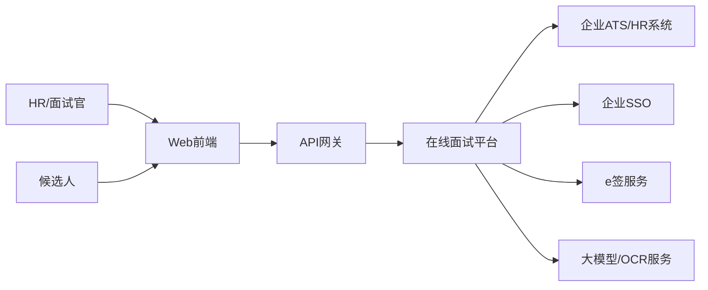
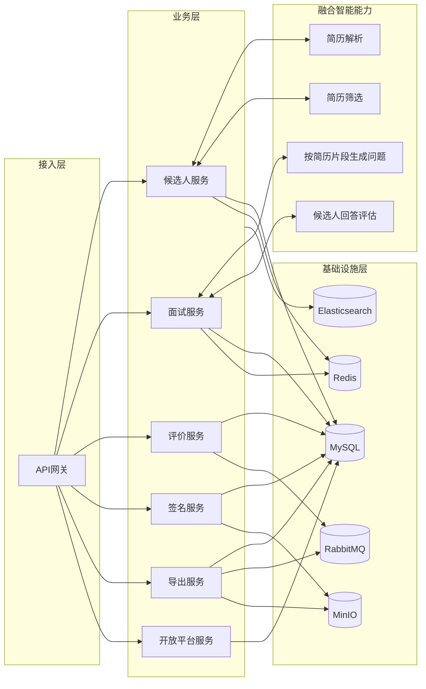
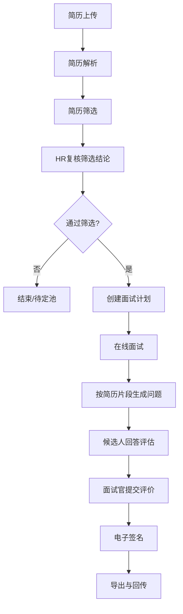
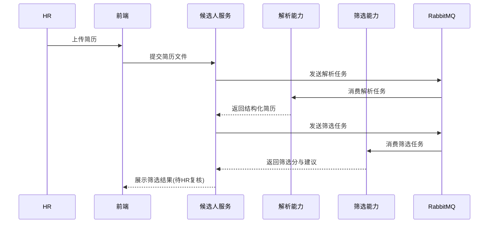
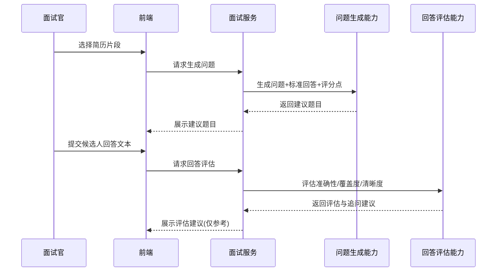
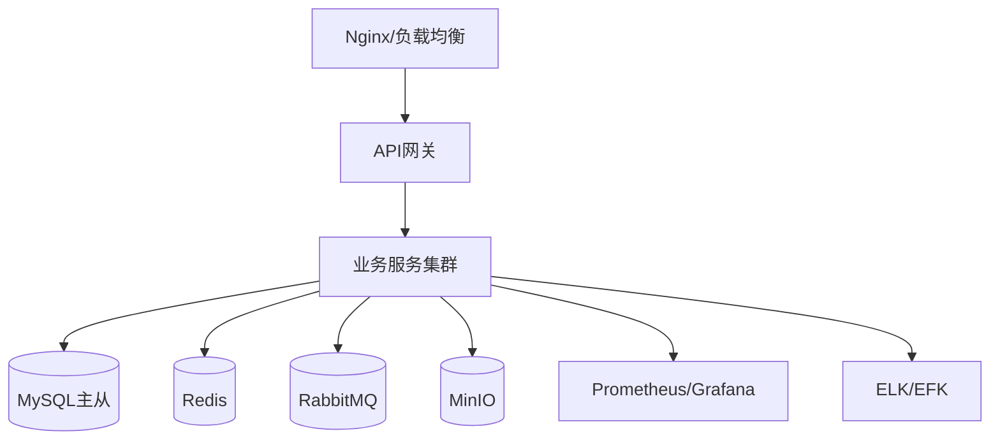

# 企业级在线面试平台 V1.0 顶层架构设计（2026 年 03 月）

## 1. 文档定位

- 本文档用于给研发团队和 AI 编码代理提供统一的顶层架构视图。
- 本文档基于《企业级在线面试平台 V1.0 详细设计（2026 年 03 月）》提炼，不替代详细设计。
- 目标是回答三个问题：系统怎么分层、模块如何协作、上线怎么控风险。

---

## 2. 架构目标与边界

### 2.1 架构目标

1. 支持“简历前置筛选 -> 在线面试 -> 评价签名 -> 结果导出/回传”的完整业务闭环。  
2. 将融合智能能力嵌入业务模块，不做独立业务域。  
3. 保证高并发可用性、可追溯性、可灰度发布与可回滚。  
4. 支持企业私有化部署与外部系统对接（ATS/HR/SSO/e签）。

### 2.2 业务边界

- In Scope：候选人、面试、评价、签名、导出、开放平台、融合智能能力。  
- Out of Scope：自动录用决策、无人审核发 Offer、复杂人才画像引擎。

---

## 3. 系统上下文与组件关系

### 3.1 系统上下文图

### 3.2 核心组件关系图

---

## 4. 分层设计与职责

### 4.1 接入层（API网关）

- 统一鉴权、限流、审计入口、TraceId 注入。
- 路由到领域服务，不承载业务规则。

### 4.2 应用层（业务服务）

- 候选人服务：简历上传、解析、筛选、复核、候选人生命周期。  
- 面试服务：排期、面试间、简历片段出题、回答评估。  
- 评价服务：评分暂存/提交、汇总、复核。  
- 签名服务：签名生成、验签、归档。  
- 导出服务：筛选Excel、成绩Excel、Word报告导出。  
- 开放平台服务：OpenAPI、Webhook、对接鉴权。

### 4.3 融合智能能力层

- 作为能力组件被业务服务调用，不作为独立业务模块。  
- 输出建议结果，不直接改写业务终态（必须人工复核）。

### 4.4 基础设施层

- MySQL：事务与核心业务数据。  
- Redis：会话、幂等键、分布式锁、短时缓存。  
- RabbitMQ：异步解耦、重试、死信。  
- MinIO：简历、签名、导出文件。  
- Elasticsearch：检索与审计查询。

---

## 5. 核心业务主链路（顶层）

---

## 6. 关键时序（示例）

### 6.1 简历前置筛选时序

### 6.2 面试中智能辅助时序

---

## 7. 顶层架构约束（必须遵守）

1. 分层依赖单向：`api -> service -> infra`。  
2. 写接口强制幂等：`X-Idempotency-Key` 必填。  
3. 状态机强校验：非法流转直接拒绝。  
4. AI 输出不得直接写终态，必须人工确认。  
5. 外部依赖统一适配层，禁止业务层硬编码第三方 SDK。  
6. 关键链路全埋点：TraceId、BizCode、ErrorCode。  
7. 异步任务必须支持重试与死信恢复。  
8. 生产发布必须灰度并具备开关回滚。

---

## 8. 非功能架构设计（NFR）

### 8.1 性能与容量

- 读接口 P95 <= 300ms，写接口 P95 <= 500ms。  
- 支持峰值并发面试间 1000。  
- 异步任务成功率 >= 98%。

### 8.2 可用性

- 系统可用性 >= 99.9%。  
- 外部服务异常时可降级（人工流程继续）。

### 8.3 安全与合规

- 敏感数据加密存储、脱敏入模。  
- 审计日志不可篡改，关键动作可追溯。

---

## 9. 部署拓扑（顶层）

---

## 10. 软件工程规范（顶层）

- 分支策略：`main` 保护，功能分支合并走 PR。  
- 代码门禁：单测、接口测试、静态检查通过后才可合并。  
- 发布门禁：压测达标 + 灰度无 P1 告警 + 回滚预案验证。  
- 变更门禁：DB 迁移脚本与回滚脚本必须成对提交。

---

## 11. 演进路线（架构视角）

1. V1.0：单体优先，保证主链路闭环。  
2. V1.1：将导出与智能任务消费者独立扩缩容。  
3. V1.2：按领域拆分服务（候选人/面试/评价）并强化事件驱动。  
4. V2.0：引入多租户隔离与跨区域容灾。

---

## 12. 10 条顶层验收用例（输入与预期）

|Case|输入|预期结果|
|---|---|---|
|1|上传标准PDF简历|解析与筛选链路成功，状态可追踪|
|2|上传模糊扫描简历|解析失败可重试，失败原因明确|
|3|筛选结果“不推荐”|必须进入HR复核，不能自动淘汰|
|4|筛选通过候选人|可直接发起面试计划|
|5|面试官按简历片段生成问题|返回问题+标准回答+评分点|
|6|提交候选人回答评估|返回准确性/覆盖度/清晰度与追问建议|
|7|签名服务超时|进入重试，超限入死信并告警|
|8|创建筛选Excel导出|导出文件包含筛选分与复核信息|
|9|开放平台回传结果|字段完整且签名校验通过|
|10|发布后出现P1告警|按预案完成开关降级与版本回滚|

---

## 13. 与详细设计的映射关系

- 本文是“顶层蓝图”，定义系统关系与约束。  
- 详细设计文档负责接口、表结构、错误码、执行细节。  
- 开发顺序建议：先读本文件第3~7章，再按详设第5、14章落地。

