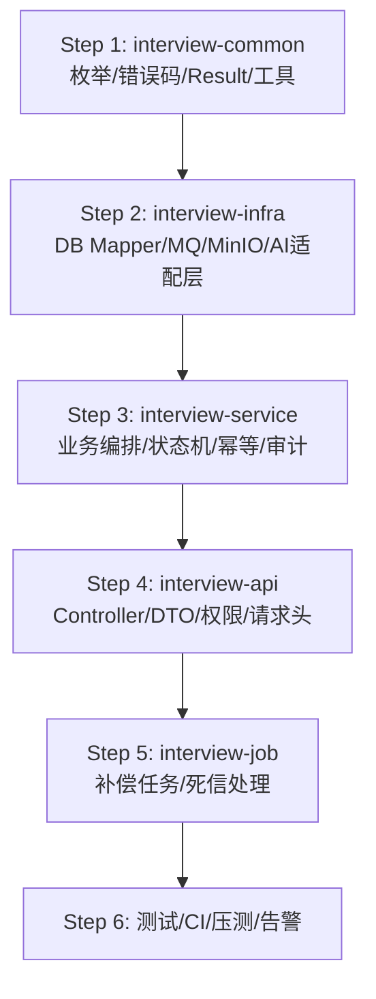
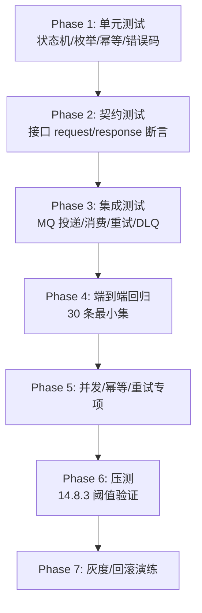

# 落地执行清单（契约统一后）

**前置条件**：`统一契约基线 v1` 已确认锁定，RFC-1~RFC-4 已回写至详设文档  
**当前状态**：冻结中，按此清单执行完毕 + 满足可解冻条件后解冻

---

## 一、DDL 执行顺序（严格按序）

> 原则：先增量建表/加字段/加索引，不删不改旧字段

### Step 1：基础表（详设 4.2 原始表）

```
V20260327_01__init_core_tables.sql
```

包含：`sys_user`、`sys_role`、`sys_menu`、`sys_role_menu`、`interview_candidate`、`interview_score_template`、`interview_score_item`、`interview_plan`、`interview_evaluate`、`interview_score_detail`、`interview_signature`、`interview_export_task`（RFC-2 版本）、`sys_operation_log`、`open_api_app`

### Step 2：AI 扩展表（详设 4.3 + RFC-1/4）

```
V20260327_02__create_ai_tables.sql
```

包含：`ai_resume_parse_result`、`ai_resume_screen_result`（含 `screen_status`，RFC-1）、`ai_question_generate_record`（含 `interview_id`/`resume_section_id`/`input_snapshot_hash`，RFC-4）、`interview_answer_assess_record`

### Step 3：筛选权重配置表（详设 13.6.2）

```
V20260327_03__ai_screen_weight_config.sql
```

包含：`ai_screen_weight_config`

### Step 4：初始化枚举字典数据

```
V20260327_04__init_enum_dict.sql
```

包含：`recommend_level`、`review_status`、`screen_status`、`export_type` 字典数据

### Step 5：回滚脚本（成对提交）

```
R20260327_01__rollback_core_tables.sql      -- 停写+保留，不删表
R20260327_02__rollback_ai_tables.sql
R20260327_03__rollback_ai_screen_weight.sql
R20260327_04__rollback_enum_dict.sql
```

---

## 二、代码改造顺序（依赖链路从底向上）




### Step 1：`interview-common`


| 子任务              | 说明                                                                                                                    |
| ---------------- | --------------------------------------------------------------------------------------------------------------------- |
| 枚举类              | `ScreenStatusEnum`、`ExportTypeEnum`、`ReviewStatusEnum`、`AiTaskStatusEnum`、`InterviewStatusEnum`、`InterviewResultEnum` |
| 错误码常量            | 按详设第 12 章区间定义                                                                                                         |
| `Result<T>` 统一响应 | 含 `code`/`msg`/`data`/`timestamp`                                                                                     |
| 幂等工具             | Redis 幂等键存取（TTL 24h）                                                                                                  |
| TraceId 工具       | 请求头解析 + MDC 透传                                                                                                        |


### Step 2：`interview-infra`


| 子任务            | 说明                             |
| -------------- | ------------------------------ |
| MyBatis Mapper | 所有表的 CRUD（含新字段）                |
| MQ Producer    | 按事件字典投递消息体                     |
| MQ Consumer 骨架 | 解析/筛选/出题/评估/导出 消费者 + 重试/退避/DLQ |
| AI 适配层         | 统一封装 LLM/OCR 调用，不暴露第三方 SDK     |
| MinIO 适配层      | 简历/签名/导出文件上传下载                 |


### Step 3：`interview-service`


| 子任务     | 说明                                                               |
| ------- | ---------------------------------------------------------------- |
| 候选人筛选编排 | upload → parse → screen → review                                 |
| 面试辅助编排  | resume查看 → question/generate → question/review → answer/evaluate |
| 导出编排    | 创建任务 → MQ → 生成文件 → 上传 MinIO → 更新状态                               |
| 状态机校验器  | 所有状态字段的允许/禁止流转统一校验                                               |
| 审计日志服务  | 关键动作自动记录 traceId/bizCode/errorCode                               |


### Step 4：`interview-api`


| 子任务        | 说明                                               |
| ---------- | ------------------------------------------------ |
| Controller | 路由 + 参数校验 + 权限注解                                 |
| DTO        | 入参/出参对象 + `javax.validation`                     |
| 统一请求头拦截器   | `Authorization`/`X-Trace-Id`/`X-Idempotency-Key` |
| 全局异常处理器    | 统一错误码映射 + 审计日志                                   |


### Step 5：`interview-job`


| 子任务    | 说明                   |
| ------ | -------------------- |
| 死信消费者  | DLQ 监听 + 告警 + 人工补偿入口 |
| 补偿定时任务 | 超时任务检测 + 重新入队        |
| 导出文件清理 | 7 天自动清理过期文件          |


### Step 6：测试/CI/压测/告警


| 子任务   | 说明                           |
| ----- | ---------------------------- |
| 单元测试  | 状态机/幂等/枚举映射/错误码              |
| 接口回归  | 30 条最小集（详设 14.16.2）          |
| 压测脚本  | k6/JMeter 覆盖 14.8.2 场景       |
| 告警规则  | Prometheus/Grafana 覆盖 14.6.4 |
| CI 门禁 | PR 合并前必须通过单测+回归+静态检查         |


---

## 三、测试执行顺序




### Phase 1：单元测试

- `ScreenStatusEnum` 状态机流转（允许/禁止）
- `ExportTypeEnum` 三值映射
- `ReviewStatusEnum` 状态机流转
- 幂等键生成与碰撞
- 错误码区间无交叉

### Phase 2：契约测试

- 每个接口的 request 必填字段校验
- response `code + label` 返回格式
- 事件映射一致性（MQ eventCode vs Webhook eventCode）

### Phase 3：集成测试

- MQ 投递 → 消费 → 结果入库
- 重试 3 次（2s/5s/10s）后进 DLQ
- DLQ 消息可按 bizCode 查询

### Phase 4：端到端回归（30 条最小集）

- 详设 14.16.2 全部 30 条
- 新增：`screen_status` 流转 / `export_type=0` / assistant 新字段落库

### Phase 5：并发/幂等/重试

- 相同幂等键重复提交 → 首次结果
- 并发锁互斥 → 仅一条成功
- AI 任务超时重试 → 不重复写终态

### Phase 6：压测

- 读 P95 ≤ 300ms，错误率 < 0.3%
- 写 P95 ≤ 500ms，错误率 < 0.5%
- 异步成功率 ≥ 98%，排队 ≤ 3s
- 慢 SQL < 0.5%，主库 CPU < 70%

### Phase 7：灰度/回滚

- 5% 灰度 30 分钟无 P1
- DLQ 无异常堆积
- 回滚演练：版本回退 + 开关关闭 + 消费者暂停 + 死信处置

---

## 四、可解冻条件核验表


| #   | 条件                             | 状态    |
| --- | ------------------------------ | ----- |
| 1   | RFC-1~RFC-4 评审通过               | ✅ 已通过 |
| 2   | 统一契约基线 v1 发布                   | ✅ 已落盘 |
| 3   | 迁移脚本 + 回滚脚本 dry-run 通过         | ⬜ 待执行 |
| 4   | 契约回归（含新增项）100% 通过              | ⬜ 待执行 |
| 5   | 事件映射联调通过（MQ + Webhook）         | ⬜ 待执行 |
| 6   | traceId/bizCode/errorCode 抽检通过 | ⬜ 待执行 |
| 7   | 主控下达"解冻"指令                     | ⬜ 待指令 |


---

## 五、文档版本索引


| 文档     | 路径                                      | 状态              |
| ------ | --------------------------------------- | --------------- |
| 顶层架构设计 | `企业级在线面试平台 V1.0 顶层架构设计（2026 年 03 月）.md` | 未修改             |
| 详细设计   | `企业级在线面试平台 V1.0 详细设计（2026 年 03 月）.md`   | 已回写 RFC-1/2/3/4 |
| 统一契约基线 | `统一契约基线 v1（2026 年 03 月）.md`             | 已锁定             |
| 落地执行清单 | `落地执行清单（契约统一后）.md`                      | 本文档             |


